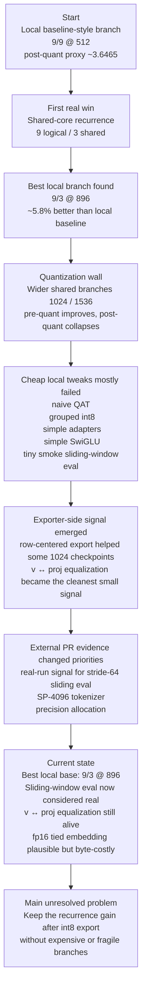

# Parameter Golf Ideas

This file is the shared idea backlog, experiment ledger, and research-loop memory for this project.

Rules for agents:
- Keep ideas loosely ranked by current evidence, and reorder them whenever new evidence changes the picture.
- Edit this file directly when a better ranking, a genuinely novel idea, or a new experiment result appears.
- Every idea should track both the current belief and the latest evidence.
- When an idea is tried, record what was tested and what happened.
- Do not delete weak or rejected ideas unless they are duplicates; keep a short reason so we do not retry bad paths blindly.
- When external research or subagent ideation is used, record what was asked, what actually helped, what was noise, and how the next prompt should change.

## Status Meanings

- `Unvalidated`: not tested yet
- `Testing`: currently being implemented or measured
- `Promising`: tested and worth further investment
- `Weak`: tested and not currently attractive
- `Rejected`: not worth pursuing under current constraints

## Ranking Criteria

Rank ideas by:
- Expected improvement in final post-roundtrip `val_bpb`
- Likelihood of staying under the `16,000,000` byte artifact cap
- Likelihood of remaining trainable within the `10 minute / 8xH100` budget
- Local implementation realism in this repo
- Likely leaderboard legitimacy

## How To Update This File

For each idea, keep these fields current:
- `Status`
- `Why`
- `Latest result`
- `Next step`

When an experiment is run:
- add a short dated note to `Experiment Log`
- update the matching idea's `Latest result`
- move the idea up or down if the evidence changed the ranking

When a research pass is run:
- add one entry to `Research Log`
- capture the prompt/question shape, not the full raw prompt
- record which ideas were genuinely new versus repeats
- record which suggestions survived contact with repo evidence
- end with a short `Prompt delta` so the next pass is sharper than the last one

## Current Snapshot

- Best current local base: shared-core recurrence `9 logical / 3 shared / dim 896`
- Best confirmed local improvement: about `5.8%` better than the local baseline-style branch on the post-quant proxy
- Main bottleneck: wider/shared models keep improving before export, then lose too much after int8 roundtrip
- Strongest active clean branches:
  - sliding-window eval
  - `v ↔ proj` equalization
  - fp16 tied embedding export
- Strategically strong but deferred here:
  - tokenizer re-export (`SP-4096`) because local prep needs about `48.17 GB` of raw docs

## Current Research Thesis

- Best current local base: shared-core recurrence (`9 logical / 3 shared / dim 896`) is the strongest branch under the current proxy, not a guaranteed global optimum.
- Main observed bottleneck: post-quant collapse, especially when width moves beyond the current local sweet spot.
- Current strongest surviving sub-signal: attention `v ↔ proj` equalization; exact MLP equalization has looked less stable across widths.
- Strong external signal from real 8xH100 PRs: sliding-window eval and tokenizer efficiency matter more than the local 4060 proxy suggested, so local null results there should not be over-weighted.
- Current research bias, subject to revision:
  1. quantization-stable architecture or parameterization changes that preserve the recurrence gain
  2. tokenizer or evaluation changes that already show clean gains on real challenge runs
  3. exporter or equivalent-transform ideas with same-checkpoint measurable effect
  4. more invasive training-dynamics ideas if simpler geometry/export fixes stop paying off

## Progress Timeline

## Research Log

### 2026-03-19 - Research refresh after free wins were exhausted
- Question shape: "Find new ideas that specifically beat shared-core recurrence by reducing post-quant collapse, not generic tuning."
- Sources used: parallel subagent ideation, AlphaXiv/web-backed repo-aware review.
- High-signal outcomes:
  - multiple independent passes converged on rotation/incoherence transforms
  - scale reparameterization / equivalent transforms emerged as the strongest second family
  - sparse outlier sidecars, optimizer-aware late quant fine-tuning, and asymmetric recurrence were credible but secondary
- Low-signal / noisy outcomes:
  - generic optimizer tuning
  - eval tricks
  - architecture swaps not tied to the quantization bottleneck
- What survived repo testing:
  - fixed Hadamard export did not clear the promotion bar
  - exact scale reparameterization had real signal, with `vproj` as the stable sub-idea
- Prompt delta:
  - future research prompts should mention that fixed rotations, simple SwiGLU, naive QAT, grouped export, and generic eval tweaks have already shown weak or mixed evidence here
  - future prompts should ask for ideas that plausibly beat the current shared-core base without assuming exporter-only tweaks are sufficient

### 2026-03-19 - Public PR review against current backlog
- Question shape: "Which open PR ideas are both real on the official challenge setup and aligned with our no-loophole direction?"
- Sources used: current GitHub PR pages and submission summaries.
- High-signal outcomes:
  - real 8xH100 evidence says sliding-window eval with `stride=64` is materially useful, even if the local proxy did not show it
  - tokenizer efficiency is a first-class branch now; SP-4096 plus sliding window reached `1.1888` in PR #53
  - precision allocation at export matters in practice: fp16 tied embeddings and mixed int8/int6 both showed real gains on official-style runs
- Low-signal / out-of-scope outcomes:
  - val-only training can post extreme numbers, but it does not match the current no-hacks direction
  - broad "systematic tuning" writeups without a sharp mechanism are weaker as idea sources
- What survived contact with our current evidence:
  - recurrence is still a strong local base, but it is no longer the only top-tier direction
  - the backlog was underweighting tokenizer and real-eval ideas because the 4060 proxy was not representative enough
- Prompt delta:
  - future research prompts should ask for leaderboard-safe ideas that have already shown signal on real 8xH100 runs, especially tokenizer and precision-allocation mechanisms
  - future prompts should separate "local proxy looked weak" from "real challenge evidence looked weak"

## Ranked Ideas

### 1. Shared-Core Depth Recurrence With Per-Layer FP32 Controls
- Status: `Promising`
- Why: Share large block matrices across multiple logical layers, keep tiny per-logical-layer control tensors untied, and trade saved bytes for more effective capacity.
- Latest result: Implemented and tested locally. It remains the best structural win. Wider settings improve raw quality, but post-quant degradation becomes the bottleneck by `dim 1024+`, so recurrence needs export/quantization help rather than more naive width.
- Next step: Treat this as the current reference architecture and compare new ideas against it unless fresh evidence points to a better base.

### 2. Scale Reparameterization / Equivalent Transforms
- Status: `Testing`
- Why: Reparameterize adjacent layers so difficult activation or weight scales are migrated into more quantization-friendly forms without changing the represented function.
- Latest result: Implemented an exact exporter-only branch that rebalances `relu^2` MLP `fc ↔ proj` pairs and attention `v ↔ proj` pairs before quantization. The bundled `mlp_vproj` transform helped `9/3 @ 896` on a same-checkpoint comparison (`3.42249372 -> 3.41939305`) while shrinking the compressed file (`8,883,498 -> 8,535,535`), but it hurt `9/3 @ 1024` (`3.44580757 -> 3.44812108`). Breaking the branch apart showed the stable effect is in `vproj`: on `1024`, `vproj` alone improved `3.44580757 -> 3.44521752`, while `mlp` alone regressed; on `896`, `vproj` alone improved `3.43716252 -> 3.43604091`.
- Next step: If this branch is continued, prioritize narrower `vproj`-focused follow-ups or learned/activation-aware scale migration over bundled MLP equalization.

### 3. Rotation / Incoherence Transforms
- Status: `Weak`
- Why: Apply a fixed or learned orthogonal change of basis around large 2D weights so outlier energy is spread across coordinates before int8 quantization instead of dominating a few rows.
- Latest result: Implemented an export-only blockwise Hadamard path and tested it on same checkpoints. On `9/3 @ 896`, post-roundtrip `val_bpb` regressed from `3.45475773` to `3.45520042` while compressed size rose from `8,836,228` to `8,904,542` bytes. On `9/3 @ 1024`, it improved from `3.44899903` to `3.44652087`, but that is only about `0.072%` better, below the `0.1%` promotion threshold, with compressed size still rising from `11,066,108` to `11,142,110` bytes.
- Next step: Leave fixed rotations below stronger options for now. Revisit only if a later learned-rotation or basis-learning branch becomes compelling enough to justify a more invasive implementation.

### 4. Tokenizer Efficiency (Higher-Vocab SentencePiece)
- Status: `Unvalidated`
- Why: A larger tokenizer can directly improve BPB by reducing tokens-per-byte, and public 8xH100 evidence now shows this is not just a theoretical lever.
- Latest result: Strong external evidence from PR #53: `SP-4096` plus stride-64 sliding window reached `1.1888 val_bpb`, with the PR explicitly attributing a major share of the gain to a better compression ratio (`0.30 tokens/byte vs 0.41`). Repo-side plumbing is mostly ready, but a local check showed the current published Hugging Face manifest still exposes only `sp1024`, so `sp4096` is not a one-command cached download yet.
- Next step: Treat this as a serious branch, not a side note, but it is currently deferred on this machine because local tokenizer/data re-export needs the hosted `docs_selected.jsonl` raw docs file (`~48.17 GB`). Revisit when the download/storage/time cost is acceptable or when better hardware/workspace is available.

### 5. Sliding-Window Evaluation With Overlapping Context
- Status: `Promising`
- Why: Real challenge runs now show that scoring each token with more context can materially lower final BPB within the separate eval budget.
- Latest result: Our tiny smoke tests looked flat, but stronger evidence now points the other way. Official-style PRs show clear gains (`1.1925` in PR #50 with eval-only changes, plus stronger stacked results in PR #53 and PR #65). A follow-up same-checkpoint local comparison on the shared-core `9/3 @ 896` branch with `TRAIN_SEQ_LEN=1024` and `VAL_MAX_TOKENS=65536` improved post-roundtrip `val_bpb` from `3.21166062` to `3.20917860` when switching the final eval from stride `1024` to stride `64`, a small but real `0.0773%` gain.
- Next step: Treat sliding-window eval as a real lever. Keep the implementation, and if we want a higher-confidence local read, test it on a stronger checkpoint or larger validation slice rather than toy smoke runs.

### 6. FP16 Tied Embedding / Output Head Export
- Status: `Testing`
- Why: The tied embedding doubles as the output head, so protecting it from int8 may remove a disproportionate amount of quantization damage for modest byte cost.
- Latest result: Strong external evidence from PR #42 says this can nearly eliminate the baseline quant gap. A first same-checkpoint local exporter probe on the saved `9/3 @ 896` checkpoint also moved in the right direction: keeping `tok_emb.weight` in fp16 reduced a tiny 4-sequence proxy loss from `5.35634136` to `5.35576963`, but increased compressed bytes from `8,020,963` to `8,619,404` (`+7.46%`). So the direction looks plausible, but the local gain was small and the byte cost is real.
- Next step: Keep this as a serious precision-allocation branch, but judge it on fuller same-checkpoint evals and byte tradeoffs rather than tiny proxy loss alone. If continued, test it with mild capacity rebalancing rather than as a pure byte increase.

### 7. Sparse Outlier Sidecar
- Status: `Unvalidated`
- Why: Keep the dense int8 core compact and preserve only the most destructive outliers or sensitive coefficients in a tiny high-precision sidecar.
- Latest result: Newly promoted from research review. It is plausible for the observed width-collapse pattern, but metadata overhead and artifact accounting make it riskier than rotations or scale reparameterization.
- Next step: Defer until after the fixed-rotation exporter probe; only test if the same-checkpoint outlier concentration looks strong enough to justify side metadata.

### 8. Optimizer-Aware Late Quant Fine-Tune
- Status: `Unvalidated`
- Why: Use a short late training phase with a more quantization-friendly optimizer and exact fake quant, rather than relying on naive Muon + fake-quant alone.
- Latest result: Newly promoted from research review. It is more credible than naive QAT, but also more expensive and harder to validate locally than exporter-only ideas.
- Next step: Only revisit after export-side ideas, especially if same-checkpoint fixes show that the remaining gap is training-dynamics rather than quantizer geometry.

### 9. Asymmetric Recurrence Topology
- Status: `Unvalidated`
- Why: Keep three physical blocks but allocate them non-uniformly across logical depth so earlier, more heterogeneous layers specialize more than the later recurrent passes.
- Latest result: Newly promoted from research review as the most credible architecture-side follow-on to the current shared-core branch.
- Next step: Keep behind rotation and scale-reparameterization work; only test after the current export bottleneck is better understood.

### 10. Row-Centered Int8 Export
- Status: `Promising`
- Why: Subtract the per-row mean before quantizing 2D weights, then add it back on dequantization so symmetric int8 bins are used on the centered residual instead of wasting dynamic range on row bias.
- Latest result: Same-checkpoint exporter probes on the clean `9/3 @ 1024` control improved post-roundtrip `val_bpb` from `3.46420609` to `3.46273076` with compressed size increasing only from `11,045,085` to `11,081,284` bytes, and the effect repeated on another `1024` checkpoint. But on the stronger `9/3 @ 896` branch it regressed slightly from `3.43772923` to `3.43820288`.
- Next step: Keep this integrated as an opt-in exporter path and use it selectively on wider shared models where per-row bias seems to be part of the quantization failure mode.

### 11. Per-Row Weight Range Regularization
- Status: `Testing`
- Why: Penalize large per-row maxima during training so the final per-row int8 export has less dynamic range to destroy.
- Latest result: `ROW_MAX_PENALTY=1e-4` on `9/3 @ 1024` improved local post-roundtrip `val_bpb` slightly from `3.46424692` to `3.45161882` on a separate short run, but a stronger `3e-4` penalty regressed to `3.48083960`. The branch has signal, but it is not robust enough yet to call a free win.
- Next step: Leave it below centered export; only revisit with tighter same-checkpoint or longer-run comparisons.

### 12. Quantization-Aware Training Matching Export Path
- Status: `Weak`
- Why: Train the model to survive the repo's actual int8 + zlib roundtrip so the final scored model loses less quality after export.
- Latest result: A first naive fake-quant pass on large linear weights with `QAT_START_STEP=10` did not produce a meaningful free win. `9/3 @ 896` improved only trivially from `3.62855` to `3.62825` post-quant bpb on the capped local proxy, while `9/3 @ 960` got worse and `9/3 @ 1024` improved only by noise-level margins.
- Next step: Leave this aside as a free-win path; revisit only if we redesign QAT more carefully instead of just toggling naive late fake quant or pair it with a different optimizer.

### 13. Grouped Int8 Export (Per-Group Scales)
- Status: `Weak`
- Why: Give each row multiple scale factors instead of one so wider matrices are quantized more precisely.
- Latest result: Implemented with `INT8_GROUP_SIZE`. Same-checkpoint comparisons on `9/3 @ 1024` changed post-roundtrip `val_bpb` only from `3.44280567` to `3.44277812`, and on `9/3 @ 1536` it slightly worsened the result while increasing compressed bytes.
- Next step: Keep the code path available, but deprioritize it behind centered export and other model-side ideas.

### 14. Mixed-Precision Layerwise Export (e.g. int8/int6)
- Status: `Unvalidated`
- Why: Different layers may deserve different export precision; public evidence suggests precision allocation can buy quality without breaking the artifact cap.
- Latest result: Strong external evidence from PR #39: a `10-layer` model with `int8` outer layers and `int6` middle layers reached about `1.2139` mean `val_bpb` across 5 seeds under the real budget, improving the baseline while staying under `16MB`.
- Next step: Keep this as a credible export branch, but only test it after simpler precision-allocation ideas such as fp16 tied embeddings or targeted equalization.

### 15. Low-Rank Factorization Of Selected Large Matrices
- Status: `Unvalidated`
- Why: Reduce parameter bytes in the largest projections, then reinvest the saved budget into width or depth.
- Latest result: Not tested yet.
- Next step: Factorize only selected attention projections first and measure artifact-size headroom before widening.

### 16. SwiGLU Replacement For ReLU^2 MLP
- Status: `Weak`
- Why: Better quality-per-parameter is plausible at this scale if the extra compute cost is acceptable.
- Latest result: Added an opt-in `MLP_KIND=swiglu` path with a near-parameter-matched hidden size. On `9/3 @ 896` it was clearly worse than the current `relu2` branch: post-roundtrip `3.43765442 -> 3.50506778`.
- Next step: Do not keep tuning this blindly on the current local proxy; only revisit if a later idea specifically suggests why SwiGLU should become more quant-stable under a different optimizer or training regime.

### 17. Custom Low-Bit Export Format (INT4 / Mixed Precision Packing)
- Status: `Unvalidated`
- Why: Shrink stored weight bytes beyond the current int8 export and fit more effective capacity under the artifact cap.
- Latest result: Not tested yet.
- Next step: Prototype serialization only, measure compressed bytes, and defer model-quality work until the size win is real.

### 18. Low-Rank Residual Adapters On Shared Blocks
- Status: `Weak`
- Why: Add tiny per-logical-layer float adapter paths so shared blocks can correct recurrence/quantization drift without paying for full untied layers.
- Latest result: A first `ADAPTER_RANK=8` test on `9/3 @ 1024` was decisively bad, jumping local post-roundtrip `val_bpb` to `3.86195309`.
- Next step: Do not sweep adapter ranks blindly; only revisit if we redesign the adapter placement or optimizer treatment.

### 19. Aggressive Compression-Aware Parameterization
- Status: `Unvalidated`
- Why: Bias training toward lower-entropy, more quantization-friendly, more zlib-friendly weights instead of treating compression as a final afterthought.
- Latest result: Not tested yet.
- Next step: Revisit after QAT results; merge if the techniques overlap too much.

### 20. Mostly-Shared Base Weights Plus Small Untied Control Paths
- Status: `Unvalidated`
- Why: Push capacity into large shared tensors and keep behavior flexible with cheap high-precision control tensors.
- Latest result: Not tested yet.
- Next step: Keep separate only if it diverges materially from the recurrence design.

### 21. Local Cache / Copy / n-gram Auxiliary Head For Web Text
- Status: `Unvalidated`
- Why: FineWeb likely has local repetitive structure that tiny dense models underuse.
- Latest result: Not tested yet.
- Next step: Only revisit after the main architecture path is measured.

### 22. Magnitude Pruning For Better Zlib Compression
- Status: `Unvalidated`
- Why: Force exact zeros and hope compression gains outweigh model-quality losses.
- Latest result: Not tested yet.
- Next step: Defer until stronger byte-saving methods are exhausted.

### 23. Persistent Validation KV Cache Across Chunks
- Status: `Rejected`
- Why: Likely too rule-sensitive for the first serious leaderboard-safe path.
- Latest result: Rejected on legitimacy grounds before implementation.
- Next step: None unless the challenge organizers explicitly endorse this style of eval carryover.

## Rejected Or Deprioritized

### Generic Hyperparameter Tuning Alone
- Status: `Rejected`
- Why: Too incremental and too likely already explored by others unless paired with a stronger architectural idea.
- Latest result: Not pursued.
- Next step: Only revisit as polishing on top of a stronger idea.

### Simply Training Longer
- Status: `Rejected`
- Why: Does not address the leaderboard track constraint and does not solve the post-quant degradation problem.
- Latest result: Rejected as off-track for the main leaderboard path.
- Next step: None for the main track.

### Naive "Make Model Bigger"
- Status: `Rejected`
- Why: The artifact cap is the core constraint; raw parameter growth without a byte strategy is not useful.
- Latest result: Rejected conceptually.
- Next step: None.

## Experiment Log

### 2026-03-19
- Seeded the ranked backlog from agent ideation and initial repo review.
- Added a Windows-safe local loop: CUDA venv on `D:\venvs\parameter-golf`, Windows-safe math SDP fallback, compile disable switch, local validation cap via `VAL_MAX_TOKENS`, and `SKIP_FINAL_QUANT_EVAL` for fast smoke runs.
- Verified fast local smoke on the RTX 4060 with `TRAIN_SEQ_LEN=256`, `TRAIN_BATCH_TOKENS=2048`, and `VAL_MAX_TOKENS=65536`; the loop now finishes in seconds instead of waiting on full validation.
- Implemented sliding-window validation and compared `EVAL_STRIDE_TOKENS=256`, `128`, and `64` on the tiny smoke config; no measurable difference showed up on that toy checkpoint.
- Implemented shared-core recurrence with per-logical-layer control tensors via `NUM_SHARED_BLOCKS`.
- Local recurrence sweep summary on capped validation after 25 steps:
  - baseline `9/9 @ 512`: pre-quant `3.6237`, post-quant `3.6465`
  - shared `9/3 @ 896`: pre-quant `3.5702`, post-quant `3.6285`
  - shared `9/3 @ 1024`: pre-quant `3.5653`, post-quant `3.6459`
  - shared `9/3 @ 1536`: pre-quant `3.5560`, post-quant `3.7418`
- Current conclusion: shared recurrence is promising, width helps, but quantization becomes the dominant limiter beyond roughly the `896` width range on the local short-run proxy.
- Naive QAT sweep summary on the shared branch with `QAT_START_STEP=10`:
  - shared `9/3 @ 896`: post-quant `3.6285 -> 3.6283` tiny improvement
  - shared `9/3 @ 960`: post-quant `3.6364 -> 3.6366` worse
  - shared `9/3 @ 1024`: post-quant `3.6459 -> 3.6456` tiny improvement
- Current conclusion: naive late fake-quant is not a worthwhile free win; the architecture branch gave a real gain, but the first QAT version did not.
- Added grouped int8 export via `INT8_GROUP_SIZE` and tested it on same-checkpoint probes:
  - `9/3 @ 1024`: `3.44280567 -> 3.44277812` post-quant bpb, tiny improvement for extra scale bytes
  - `9/3 @ 1536`: `3.52435415 -> 3.52438782` post-quant bpb, slight regression
- Current conclusion: grouped scales are not the free exporter win they first appeared to be; keep the code, lower the priority.
- Added low-rank residual adapters via `ADAPTER_RANK`.
  - `9/3 @ 1024`, `ADAPTER_RANK=8`: post-quant `3.86195309`
- Current conclusion: the first adapter version is a clear miss and should not be rank-swept casually.
- Added `ROW_MAX_PENALTY` training regularization:
  - `9/3 @ 1024`, `1e-4`: post-quant `3.45161882`
  - `9/3 @ 1024`, `3e-4`: post-quant `3.48083960`
- Current conclusion: row-range regularization may have a narrow useful range, but it is not robust enough yet to outrank stronger ideas.
- Added row-centered int8 export via `INT8_CENTER_ROWS` and verified it on same checkpoints:
  - clean `9/3 @ 1024` control: `3.46420609 -> 3.46273076`, compressed size `11,045,085 -> 11,081,284` bytes
  - another `1024` checkpoint: similar ~`0.0012` bpb gain
- Added a follow-up probe on the current best `9/3 @ 896` checkpoint:
  - `3.43772923 -> 3.43820288`, compressed size `8,883,503 -> 8,914,637` bytes
- Current conclusion: centered export is a real width-recovery tool for the `1024` branch, but not a universal default for the best current `896` branch.
- Added an opt-in SwiGLU MLP path via `MLP_KIND=swiglu` with near-matched hidden size.
  - `9/3 @ 896`: post-quant `3.43765442 -> 3.50506778`
- Current conclusion: the first SwiGLU branch is clearly worse on the best current shared-core model and should not be tuned further as a free win.
- Added a research refresh using AlphaXiv/web-backed parallel agent passes.
  - Independent threads converged on rotations/incoherence transforms as the strongest new idea.
  - Scale reparameterization / equivalent transforms emerged as the strongest second family.
  - Sparse outlier sidecars, optimizer-aware late quant fine-tuning, and asymmetric recurrence topology were promoted as secondary candidates.
- Current conclusion: the obvious next branch is an export-only rotation probe, not more blind tuning on the existing backlog.
- Implemented an export-only blockwise Hadamard rotation path with `INT8_ROTATION_KIND`, `INT8_ROTATION_BLOCK_SIZE`, and `INT8_ROTATION_TARGET`.
- Verified functionally that the Hadamard path inverts to numerical precision and safely skips non-divisible tensors.
- Same-checkpoint exporter probes:
  - `9/3 @ 896`: post-quant `3.45475773 -> 3.45520042`, compressed size `8,836,228 -> 8,904,542`
  - `9/3 @ 1024`: post-quant `3.44899903 -> 3.44652087`, compressed size `11,066,108 -> 11,142,110`
- Current conclusion: fixed blockwise Hadamard export is a real but too-small width-recovery effect. It misses the `0.1%` improvement bar, so the next serious branch should move to scale reparameterization / equivalent transforms instead of escalating fixed rotations.
- Implemented an exact exporter-only scale-reparameterization path with `INT8_SCALE_REPARAM_KIND` and `INT8_SCALE_REPARAM_CLAMP`.
- Verified functionally that both supported exact transforms preserve outputs to numerical precision:
  - `relu^2` MLP `fc ↔ proj`
  - attention `v ↔ proj` under GQA-aware channel repetition
- Same-checkpoint exporter probes:
  - `9/3 @ 896`, bundled `mlp_vproj`: `3.42249372 -> 3.41939305`, compressed size `8,883,498 -> 8,535,535`
  - `9/3 @ 1024`, bundled `mlp_vproj`: `3.44580757 -> 3.44812108`, compressed size `11,063,310 -> 10,581,948`
  - `9/3 @ 1024` breakdown:
    - `mlp`: `3.44877007`
    - `vproj`: `3.44521752`
    - `mlp_vproj`: `3.44812108`
  - `9/3 @ 896` breakdown:
    - `mlp`: `3.43721597`
    - `vproj`: `3.43604091`
    - `mlp_vproj`: `3.43586773`
- Current conclusion: this family is more promising than fixed rotations, but the useful part is specifically attention `v ↔ proj` equalization. Exact MLP equalization is unstable across widths and should not be the default continuation.
- Reviewed stronger public PRs and then reran sliding-window eval on a less toy-like local checkpoint:
  - current shared-core branch `9/3 @ 896`, `TRAIN_SEQ_LEN=1024`, `VAL_MAX_TOKENS=65536`
  - same checkpoint final eval:
    - standard stride `1024`: `3.21166062`
    - sliding stride `64`: `3.20917860`
- Current conclusion: the local proxy now agrees directionally with the public PR evidence that sliding-window eval is a real lever, even if the gain on this local checkpoint is much smaller than on 8xH100.
- Verified tokenizer branch readiness after reviewing PR #53:
  - existing data scripts already support `sp<VOCAB_SIZE>` variants, including `sp4096`
  - the local repo only lacked the `sp_bpe_4096` entry in `data/tokenizer_specs.json`
- Tried to fetch a cached `sp4096` slice via `cached_challenge_fineweb.py` and hit a real limitation:
  - the current published Hugging Face `datasets/manifest.json` only exposes `fineweb10B_sp1024`
  - `fineweb10B_sp4096` is therefore not currently available as a cached remote dataset through the helper
- Current conclusion: the tokenizer branch is still real, but it needs local tokenizer/data re-export rather than a simple cached download.
- Added an fp16 tied-embedding exporter hook via `INT8_KEEP_TOK_EMB_FP16` and ran a same-checkpoint micro-probe on the saved `9/3 @ 896` checkpoint:
  - standard int8 export: compressed bytes `8,020,963`, 4-sequence proxy loss `5.35634136`
  - keep `tok_emb.weight` in fp16: compressed bytes `8,619,404`, 4-sequence proxy loss `5.35576963`
- Current conclusion: fp16 tied embedding likely helps, but the local gain is small on this checkpoint and the byte tax is non-trivial (`+7.46%`). This stays alive as a precision-allocation branch, but it should be judged on fuller evals and possibly paired with capacity rebalancing.
