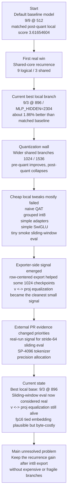

# Parameter Golf Ideas

This file is the shared idea backlog, experiment ledger, and research-loop memory for this project.

Rules for agents:
- Keep ideas loosely ranked by current evidence, and reorder them whenever new evidence changes the picture.
- Edit this file directly when a better ranking, a genuinely novel idea, or a new experiment result appears.
- Every idea should track both the current belief and the latest evidence.
- When an idea is tried, record what was tested and what happened.
- Do not delete weak or rejected ideas unless they are duplicates; keep a short reason so we do not retry bad paths blindly.
- When external research or subagent ideation is used, record what was asked, what actually helped, what was noise, and how the next prompt should change.

## Status Meanings

- `Unvalidated`: not tested yet
- `Testing`: currently being implemented or measured
- `Promising`: tested and worth further investment
- `Weak`: tested and not currently attractive
- `Rejected`: not worth pursuing under current constraints

## Ranking Criteria

Rank ideas by:
- Expected improvement in final post-roundtrip `val_bpb`
- Likelihood of staying under the `16,000,000` byte artifact cap
- Likelihood of remaining trainable within the `10 minute / 8xH100` budget
- Local implementation realism in this repo
- Likely leaderboard legitimacy

## How To Update This File

For each idea, keep these fields current:
- `Status`
- `Why`
- `Latest result`
- `Next step`

When an experiment is run:
- add a short dated note to `Experiment Log`
- update the matching idea's `Latest result`
- move the idea up or down if the evidence changed the ranking

When a research pass is run:
- add one entry to `Research Log`
- capture the prompt/question shape, not the full raw prompt
- record which ideas were genuinely new versus repeats
- record which suggestions survived contact with repo evidence
- end with a short `Prompt delta` so the next pass is sharper than the last one

## Current Snapshot

- Best current local base: shared-core recurrence `9 logical / 3 shared / dim 896`
- Best current short-run local branch: shared-core `9 logical / 3 shared / dim 896` with `MLP_HIDDEN=2304`
- Best confirmed local improvement:
  - about `1.86%` better than a matched `9/9 @ 512` baseline under the current 10-step stride-64 post-quant setup
- Main bottleneck: wider/shared models keep improving before export, then lose too much after int8 roundtrip
- Strongest active clean branches:
  - sliding-window eval
  - moderate MLP widening on the shared-core base
  - kurtosis-penalized MLP training
  - `v <-> proj` equalization
  - tied-embedding precision handling
- Strategically strong but deferred here:
  - tokenizer re-export (`SP-4096`) because local prep needs about `48.17 GB` of raw docs, even though tokenizer artifact accounting may be more favorable than we first assumed
  - longer-context training (`2048+`) because public PR evidence is strong but the short 4060 proxy looked locally unattractive

## Current Research Thesis

- Best current local base: shared-core recurrence (`9 logical / 3 shared / dim 896`) is the strongest branch under the current proxy, not a guaranteed global optimum.
- Main observed bottleneck: post-quant collapse, especially when width moves beyond the current local sweet spot.
- Current strongest surviving sub-signal: attention `v <-> proj` equalization; exact MLP equalization has looked less stable across widths.
- Strong external signal from real 8xH100 PRs: sliding-window eval and tokenizer efficiency matter more than the local 4060 proxy suggested, so local null results there should not be over-weighted.
- New external signal from the broader PR sweep: longer train/eval context and byte-funded wider MLPs look cleaner than many exporter-only tricks, and the first direct local probe says the wider-MLP part is the real win here.
- Current research bias, subject to revision:
  1. quantization-stable architecture or parameterization changes that preserve the recurrence gain
  2. tokenizer, context-length, or evaluation changes that already show clean gains on real challenge runs
  3. exporter or equivalent-transform ideas with same-checkpoint measurable effect
  4. more invasive training-dynamics or precision-allocation ideas if simpler geometry/export fixes stop paying off
  5. treat the short 10-step local proxy as noisy enough that same-code controls matter more than comparing across distant code states

## Progress Timeline

## Research Log

### 2026-03-19 - Research refresh after free wins were exhausted
- Question shape: "Find new ideas that specifically beat shared-core recurrence by reducing post-quant collapse, not generic tuning."
- Sources used: parallel subagent ideation, AlphaXiv/web-backed repo-aware review.
- High-signal outcomes:
  - multiple independent passes converged on rotation/incoherence transforms
  - scale reparameterization / equivalent transforms emerged as the strongest second family
  - sparse outlier sidecars, optimizer-aware late quant fine-tuning, and asymmetric recurrence were credible but secondary
- Low-signal / noisy outcomes:
  - generic optimizer tuning
  - eval tricks
  - architecture swaps not tied to the quantization bottleneck
- What survived repo testing:
  - fixed Hadamard export did not clear the promotion bar
  - exact scale reparameterization had real signal, with `vproj` as the stable sub-idea
- Prompt delta:
  - future research prompts should mention that fixed rotations, simple SwiGLU, naive QAT, grouped export, and generic eval tweaks have already shown weak or mixed evidence here
  - future prompts should ask for ideas that plausibly beat the current shared-core base without assuming exporter-only tweaks are sufficient

### 2026-03-19 - Public PR review against current backlog
- Question shape: "Which open PR ideas are both real on the official challenge setup and aligned with our no-loophole direction?"
- Sources used: current GitHub PR pages and submission summaries.
- High-signal outcomes:
  - real 8xH100 evidence says sliding-window eval with `stride=64` is materially useful, even if the local proxy did not show it
  - tokenizer efficiency is a first-class branch now; SP-4096 plus sliding window reached `1.1888` in PR #53
  - precision allocation at export matters in practice: fp16 tied embeddings and mixed int8/int6 both showed real gains on official-style runs
- Low-signal / out-of-scope outcomes:
  - val-only training can post extreme numbers, but it does not match the current no-hacks direction
  - broad "systematic tuning" writeups without a sharp mechanism are weaker as idea sources
- What survived contact with our current evidence:
  - recurrence is still a strong local base, but it is no longer the only top-tier direction
  - the backlog was underweighting tokenizer and real-eval ideas because the 4060 proxy was not representative enough
- Prompt delta:
  - future research prompts should ask for leaderboard-safe ideas that have already shown signal on real 8xH100 runs, especially tokenizer and precision-allocation mechanisms
  - future prompts should separate "local proxy looked weak" from "real challenge evidence looked weak"

### 2026-03-19 - PR audit for `#36` through `#70`
- Question shape: "Across PRs `#36` through the current latest, which clean leaderboard-safe ideas are still missing or underweighted in our memory?"
- Sources used: GitHub PR pages and submission summaries for `#36-#70` only.
- High-signal outcomes:
  - long-context training is a real clean branch, not just an eval trick: PR #65 pushed `TRAIN_SEQ_LEN=4096` with matching long-context eval, and PR #63 independently supported the same family at `2048`
  - mixed-precision export is more compelling when framed as "buy capacity with saved bytes": PR #65 used int6/int8 allocation plus a wider `MLP_MULT=3` branch, which is stronger than our earlier generic mixed-precision note
  - PR #61 adds a cleaner schedule-side sub-idea: a very long warmdown can sharply reduce post-training quantization damage even without changing the architecture
  - sliding-window eval, tokenizer efficiency, and fp16 tied embeddings were reaffirmed rather than replaced
- Low-signal / out-of-scope outcomes:
  - val-train submissions stay out of scope for the current no-loophole direction
  - several recurrence/QAT WIPs repeated ideas we already tested without stronger evidence
  - weak system-specific submissions or no-description PRs did not add useful backlog signal
- What survived contact with our current evidence:
  - long-context training + matching eval deserves promotion as a first-class clean branch
  - mixed-precision export should be thought of as a way to fund more useful capacity, especially wider MLPs, not only as a tiny exporter tweak
  - overtone / NTK-style initialization ideas from PRs #59/#60 are interesting but still watchlist-tier, not promotion-tier
- Prompt delta:
  - future PR research should ask whether a branch wins by improving model quality, by improving BPB accounting, or by reallocating artifact bytes more efficiently
  - future prompts should explicitly distinguish "already captured but corroborated" from "genuinely new direction"

### 2026-03-19 - PR audit for `#1` through `#35`
- Question shape: "Across the early PRs, is there any clean new signal beyond the recurrence / QAT / adapter families we already track?"
- Sources used: GitHub PR pages and writeups for the low-number PRs that looked substantive.
- High-signal outcomes:
  - PR #10 added the only clear new nuance: tied embeddings appear worth protecting during training as an fp32-master parameter, not only at export time
- Low-signal / repetitive outcomes:
  - most early recurrence, LoRA, QAT, and SwiGLU PRs overlapped heavily with branches we already tested or already rank
  - several early PRs were weaker-than-baseline, too WIP, or mainly useful as confirmation that others explored the same families
- What survived contact with our current evidence:
  - tied-embedding precision should be treated as a branch that can include both training-side and export-side protection
  - early PRs do not currently add another top-tier clean branch beyond what is already in memory
- Prompt delta:
  - future PR research should spend less time on early recurrence/QAT repetition and more time on mechanism-level deltas that materially change how a familiar family works

### 2026-03-19 - Issue audit
- Question shape: "Do the repo issues reveal hidden constraints or strategic clarifications that should change our backlog?"
- Sources used: current GitHub issues, especially open issues and constraint-related threads.
- High-signal outcomes:
  - Issue #43 suggests the tokenizer artifact itself may not count toward submission size, which strengthens the tokenizer branch strategically
- Low-signal outcomes:
  - environment clarification requests reinforce caution but do not create a new model idea
  - process/meta issues did not add useful backlog signal
- What survived contact with our current evidence:
  - tokenizer work remains locally deferred for cost, but its strategic upside is even stronger than we were informally modeling
- Prompt delta:
  - future external research should separate "strategically strong but locally expensive" from "strategically weak"

### 2026-03-19 - Targeted idea pass against the widened shared-core winner
- Question shape: "What new ideas specifically beat `9/3 @ 896 / MLP_HIDDEN=2304`, without repeating the failed exporter micro-tweak loop?"
- Sources used: targeted repo-aware subagent ideation focused on the current widened shared-core branch.
- High-signal outcomes:
  - kurtosis-aware MLP regularization was the clearest new training-dynamics idea, and it already produced the first clean same-code local gain after implementation
  - component-decoupled sharing emerged as the most credible architecture-side follow-up: keep attention highly shared, but let MLP capacity specialize more
  - per-block warmdown calibration emerged as the strongest quantization-side follow-up that is not just another exporter trick
- Low-signal / noisy outcomes:
  - hard weight clipping is too close to the already fragile row-max-penalty family
  - entropy-sorted packing and dual-scale low-bit packing are interesting, but still too speculative relative to the current bottleneck
  - skip-gating / residual-decay ideas are plausible watchlist material, not priority branches yet
- What survived contact with repo evidence:
  - the current best branch is still "shared-core + moderately wider MLP"; the new ideas that deserve memory are the ones that improve that family, not replace it blindly
  - the strongest next candidate families are now: kurtosis regularization, less-uniform sharing inside the block, and post-training per-block calibration
- Prompt delta:
  - future idea prompts should anchor on "beat the widened shared-core branch by reallocating capacity or reducing post-quant collapse", not on generic novelty
  - future prompts should ask whether an idea improves the branch by changing architecture, training dynamics, or post-training calibration

## Ranked Ideas

### 1. Shared-Core Depth Recurrence With Per-Layer FP32 Controls
- Status: `Promising`
- Why: Share large block matrices across multiple logical layers, keep tiny per-logical-layer control tensors untied, and trade saved bytes for more effective capacity.
- Latest result: Implemented and tested locally. It remains the best structural win. Wider settings improve raw quality, but post-quant degradation becomes the bottleneck by `dim 1024+`, so recurrence needs export/quantization help rather than more naive width.
- Next step: Treat this as the current reference architecture and compare new ideas against it unless fresh evidence points to a better base.

### 2. Scale Reparameterization / Equivalent Transforms
- Status: `Testing`
- Why: Reparameterize adjacent layers so difficult activation or weight scales are migrated into more quantization-friendly forms without changing the represented function.
- Latest result: Implemented an exact exporter-only branch that rebalances `relu^2` MLP `fc <-> proj` pairs and attention `v <-> proj` pairs before quantization. The bundled `mlp_vproj` transform helped `9/3 @ 896` on a same-checkpoint comparison (`3.42249372 -> 3.41939305`) while shrinking the compressed file (`8,883,498 -> 8,535,535`), but it hurt `9/3 @ 1024` (`3.44580757 -> 3.44812108`). Breaking the branch apart showed the stable effect is in `vproj`: on `1024`, `vproj` alone improved `3.44580757 -> 3.44521752`, while `mlp` alone regressed; on `896`, `vproj` alone improved `3.43716252 -> 3.43604091`.
- Next step: If this branch is continued, prioritize narrower `vproj`-focused follow-ups or learned/activation-aware scale migration over bundled MLP equalization.

### 2a. Moderate MLP Widening On The Shared-Core Base
- Status: `Promising`
- Why: The current shared-core base appears under-invested in MLP capacity, and the artifact cap is not the immediate limiter on the local best branch, so a wider hidden dimension may be a cleaner way to buy quality than more exporter complexity.
- Latest result: This is the strongest new local branch after the PR-guided mixed-precision exploration. On the `9/3 @ 896` base with `EVAL_STRIDE_TOKENS=64` and a short 10-step proxy:
  - baseline `MLP_HIDDEN=1792`: `final_int8_zlib_roundtrip_exact val_bpb 3.56827291`, compressed size `5,533,450`
  - wider `MLP_HIDDEN=2304`: `3.54919676`, compressed size `6,123,000`
  - wider `MLP_HIDDEN=2688`: `3.56047610`, compressed size `6,608,336`
  The `2304` setting was clearly best of the tested values.
- Next step: Treat `MLP_HIDDEN=2304` as the leading follow-on branch from the current shared-core base. Nearby checks at `2176` (`3.59427578`) and `2432` (`3.58679594`) were both worse, so there is no reason to keep sweeping this width range blindly.

### 2b. Kurtosis-Penalized MLP Training
- Status: `Testing`
- Why: Penalize excess kurtosis in MLP weight rows during training so the widened shared-core branch learns smoother, less heavy-tailed weight distributions that survive per-row int8 export better.
- Latest result: Added `KURTOSIS_PENALTY` as an MLP-only training regularizer and tested it on the current widened branch (`9/3 @ 896`, `MLP_HIDDEN=2304`) under the same short 10-step stride-64 post-quant setup:
  - same-code control `KURTOSIS_PENALTY=0`: `final_int8_zlib_roundtrip_exact val_bpb 3.57991740`, compressed size `6,237,578`
  - `KURTOSIS_PENALTY=1e-5`: `3.57012118`, compressed size `6,207,818`
  - `KURTOSIS_PENALTY=3e-5`: `3.56901227`, compressed size `6,208,211`
  This is a real same-code local improvement signal, but the short proxy is noisy enough that it should not yet replace the broader current-best branch headline.
- Next step: Keep this active. If continued, try one stronger-but-still-safe value (for example `1e-4`) or rerun the best current setting to confirm the gain is robust rather than one noisy good draw.

### 2c. Component-Decoupled Sharing (Shared Attention, Less-Shared MLP)
- Status: `Unvalidated`
- Why: The current best branch keeps the whole transformer block shared, but the latest evidence says the incremental gain is coming mostly from MLP capacity rather than uniformly from the whole block. A hybrid sharing scheme could spend bytes where they matter most.
- Latest result: Not yet implemented here. The latest targeted ideation pass repeatedly converged on the same mechanism: keep attention highly shared to preserve the recurrence byte win, but let MLPs specialize more aggressively across depth or across shared blocks. This is meaningfully different from the weak low-rank-adapter branch because it changes where full-rank capacity lives instead of adding a tiny additive bypass.
- Next step: If we continue architecture exploration inside the current family, this is one of the cleanest follow-ons: either share attention while untieing some or all MLP weights, or try heterogeneous MLP widths across the shared blocks before abandoning the shared-core base.

### 2d. Per-Block Warmdown Quantization Calibration
- Status: `Unvalidated`
- Why: Shared blocks are reused across multiple logical depths, so a short post-training calibration pass that optimizes their quantized reconstruction could pay back more than a generic exporter tweak or naive QAT.
- Latest result: Not yet implemented here. The latest targeted ideation pass elevated this as the strongest post-training follow-up that is neither another pure exporter trick nor another full training rewrite.
- Next step: If exporter-only ideas keep saturating, test a narrow calibration loop on the current widened branch: freeze the trained checkpoint, optimize small per-channel corrections or equivalent scales for the reused block matrices, and judge it on same-checkpoint post-roundtrip eval.

### 3. Rotation / Incoherence Transforms
- Status: `Weak`
- Why: Apply a fixed or learned orthogonal change of basis around large 2D weights so outlier energy is spread across coordinates before int8 quantization instead of dominating a few rows.
- Latest result: Implemented an export-only blockwise Hadamard path and tested it on same checkpoints. On `9/3 @ 896`, post-roundtrip `val_bpb` regressed from `3.45475773` to `3.45520042` while compressed size rose from `8,836,228` to `8,904,542` bytes. On `9/3 @ 1024`, it improved from `3.44899903` to `3.44652087`, but that is only about `0.072%` better, below the `0.1%` promotion threshold, with compressed size still rising from `11,066,108` to `11,142,110` bytes.
- Next step: Leave fixed rotations below stronger options for now. Revisit only if a later learned-rotation or basis-learning branch becomes compelling enough to justify a more invasive implementation.

### 4. Tokenizer Efficiency (Higher-Vocab SentencePiece)
- Status: `Unvalidated`
- Why: A larger tokenizer can directly improve BPB by reducing tokens-per-byte, and public 8xH100 evidence now shows this is not just a theoretical lever.
- Latest result: Strong external evidence from PR #53: `SP-4096` plus stride-64 sliding window reached `1.1888 val_bpb`, with the PR explicitly attributing a major share of the gain to a better compression ratio (`0.30 tokens/byte vs 0.41`). Repo-side plumbing is mostly ready, but a local check showed the current published Hugging Face manifest still exposes only `sp1024`, so `sp4096` is not a one-command cached download yet. Issue #43 also suggests the tokenizer artifact itself may not count toward submission bytes, which makes this branch strategically stronger than our earlier informal byte model.
- Next step: Treat this as a serious branch, not a side note, but it is currently deferred on this machine because local tokenizer/data re-export needs the hosted `docs_selected.jsonl` raw docs file (`~48.17 GB`). Revisit when the download/storage/time cost is acceptable or when better hardware/workspace is available.

### 5. Sliding-Window Evaluation With Overlapping Context
- Status: `Promising`
- Why: Real challenge runs now show that scoring each token with more context can materially lower final BPB within the separate eval budget.
- Latest result: Our tiny smoke tests looked flat, but stronger evidence now points the other way. Official-style PRs show clear gains (`1.1925` in PR #50 with eval-only changes, plus stronger stacked results in PR #53 and PR #65). A follow-up same-checkpoint local comparison on the shared-core `9/3 @ 896` branch with `TRAIN_SEQ_LEN=1024` and `VAL_MAX_TOKENS=65536` improved post-roundtrip `val_bpb` from `3.21166062` to `3.20917860` when switching the final eval from stride `1024` to stride `64`, a small but real `0.0773%` gain.
- Next step: Treat sliding-window eval as a real lever. Keep the implementation, and if we want a higher-confidence local read, test it on a stronger checkpoint or larger validation slice rather than toy smoke runs.

### 6. Long-Context Training + Matching Long-Context Eval
- Status: `Unvalidated`
- Why: Real challenge runs now suggest that training and evaluating at `2048-4096` context is a clean gain source in its own right, not just a garnish on sliding-window eval.
- Latest result: Strong external evidence remains: PR #65 reported `1.1808 val_bpb` with `TRAIN_SEQ_LEN=4096`, tuned Muon, and matching long-context sliding eval; PR #63 independently reached `1.2067` with `SEQ_LEN=2048` plus fp16 tied embeddings. But a corrected local feasibility probe on the current `9/3 @ 896` base showed the limitation of the 4060 proxy: `TRAIN_SEQ_LEN=2048` is technically feasible with `TRAIN_BATCH_TOKENS=16384`, but a short 10-step matched-token run was slower and clearly worse than the `1024` reference (`val_bpb 4.7467` at about `3.21s/step` vs `3.7266` at about `2.59s/step`).
- Next step: Keep this branch strategically alive because of the real-run PR evidence, but do not spend many more 4060 cycles trying to prove it locally. Revisit on better hardware or as part of a more official-style run, not as a short local tuning loop.

### 7. Tied Embedding / Output Head Precision Handling
- Status: `Testing`
- Why: The tied embedding doubles as the output head, so protecting it from low precision may remove a disproportionate amount of damage during both optimization and export.
- Latest result: Strong external evidence from PR #42 says fp16 export here can nearly eliminate the baseline quant gap, and PR #10 adds a useful training-side nuance: the tied embedding should likely remain an fp32-master parameter during optimization, not only get special treatment at export. But on the short local 4060 proxy, the training-side refinement did not turn into a free win: a same-code 10-step `9/3 @ 896` control at `TRAIN_SEQ_LEN=1024` reached `val_bpb 3.5984`, while `TIED_EMB_FP32_MASTER=1` landed at `3.6019` with a slightly larger int8+zlib artifact (`5,645,476 -> 5,661,947` bytes). The earlier exporter-only fp16 probe still moved a tiny 4-sequence proxy loss in the right direction (`5.35634136 -> 5.35576963`) but at a real byte cost (`+7.46%`).
- Next step: Keep this branch alive because the external evidence is strong, but do not assume the training-side fp32-master variant is a free local gain. If continued, judge it on fuller post-quant evals or as a combined training+export precision branch with explicit byte rebalancing.

### 8. Sparse Outlier Sidecar
- Status: `Unvalidated`
- Why: Keep the dense int8 core compact and preserve only the most destructive outliers or sensitive coefficients in a tiny high-precision sidecar.
- Latest result: Newly promoted from research review. It is plausible for the observed width-collapse pattern, but metadata overhead and artifact accounting make it riskier than rotations or scale reparameterization.
- Next step: Defer until after the fixed-rotation exporter probe; only test if the same-checkpoint outlier concentration looks strong enough to justify side metadata.

### 9. Optimizer-Aware Late Quant Fine-Tune
- Status: `Unvalidated`
- Why: Use a short late training phase with a more quantization-friendly optimizer and exact fake quant, rather than relying on naive Muon + fake-quant alone.
- Latest result: Newly promoted from research review. It is more credible than naive QAT, but also more expensive and harder to validate locally than exporter-only ideas.
- Next step: Only revisit after export-side ideas, especially if same-checkpoint fixes show that the remaining gap is training-dynamics rather than quantizer geometry.

### 10. Asymmetric Recurrence Topology
- Status: `Unvalidated`
- Why: Keep three physical blocks but allocate them non-uniformly across logical depth so earlier, more heterogeneous layers specialize more than the later recurrent passes.
- Latest result: Newly promoted from research review as the most credible architecture-side follow-on to the current shared-core branch.
- Next step: Keep behind rotation and scale-reparameterization work; only test after the current export bottleneck is better understood.

### 11. Row-Centered Int8 Export
- Status: `Promising`
- Why: Subtract the per-row mean before quantizing 2D weights, then add it back on dequantization so symmetric int8 bins are used on the centered residual instead of wasting dynamic range on row bias.
- Latest result: Same-checkpoint exporter probes on the clean `9/3 @ 1024` control improved post-roundtrip `val_bpb` from `3.46420609` to `3.46273076` with compressed size increasing only from `11,045,085` to `11,081,284` bytes, and the effect repeated on another `1024` checkpoint. But on the stronger `9/3 @ 896` branch it regressed slightly from `3.43772923` to `3.43820288`.
- Next step: Keep this integrated as an opt-in exporter path and use it selectively on wider shared models where per-row bias seems to be part of the quantization failure mode.

### 12. Per-Row Weight Range Regularization
- Status: `Testing`
- Why: Penalize large per-row maxima during training so the final per-row int8 export has less dynamic range to destroy.
- Latest result: `ROW_MAX_PENALTY=1e-4` on `9/3 @ 1024` improved local post-roundtrip `val_bpb` slightly from `3.46424692` to `3.45161882` on a separate short run, but a stronger `3e-4` penalty regressed to `3.48083960`. The branch has signal, but it is not robust enough yet to call a free win.
- Next step: Leave it below centered export; only revisit with tighter same-checkpoint or longer-run comparisons.

### 13. Quantization-Aware Training Matching Export Path
- Status: `Weak`
- Why: Train the model to survive the repo's actual int8 + zlib roundtrip so the final scored model loses less quality after export.
- Latest result: A first naive fake-quant pass on large linear weights with `QAT_START_STEP=10` did not produce a meaningful free win. `9/3 @ 896` improved only trivially from `3.62855` to `3.62825` post-quant bpb on the capped local proxy, while `9/3 @ 960` got worse and `9/3 @ 1024` improved only by noise-level margins.
- Next step: Leave this aside as a free-win path; revisit only if we redesign QAT more carefully instead of just toggling naive late fake quant or pair it with a different optimizer.

### 14. Grouped Int8 Export (Per-Group Scales)
- Status: `Weak`
- Why: Give each row multiple scale factors instead of one so wider matrices are quantized more precisely.
- Latest result: Implemented with `INT8_GROUP_SIZE`. Same-checkpoint comparisons on `9/3 @ 1024` changed post-roundtrip `val_bpb` only from `3.44280567` to `3.44277812`, and on `9/3 @ 1536` it slightly worsened the result while increasing compressed bytes.
- Next step: Keep the code path available, but deprioritize it behind centered export and other model-side ideas.

### 15. Mixed-Precision Layerwise Export (e.g. int8/int6)
- Status: `Unvalidated`
- Why: Different layers may deserve different export precision, and the most useful version of this idea may be to spend the saved bytes on better model capacity rather than just shrinking artifacts.
- Latest result: Strong external evidence from PR #39: a `10-layer` model with `int8` outer layers and `int6` middle layers reached about `1.2139` mean `val_bpb` across 5 seeds under the real budget. The newer PR #65 strengthened the idea by combining mixed precision with a wider `MLP_MULT=3` branch and stride-64 eval, reaching `1.1630`; the clean sub-idea is that precision allocation can fund more useful width. Locally, the same-checkpoint exporter probe was encouraging but narrower than the PR framing:
  - saved current-best checkpoint, `int6` on `mlp_proj` only: compressed bytes `8,878,592 -> 7,685,366` (`-13.4%`) with only a tiny regression `3.43550794 -> 3.43626937`
  - `int6` on all MLP weights: compressed bytes `8,878,592 -> 6,621,505` but regressed much more strongly to `3.45281219`
  - on the retrained wider-MLP branch, `MLP_HIDDEN=2304` plus `int6 mlp_proj` reached `3.55609707`, which was still worse than plain widened int8 (`3.54919676`) while saving only about `1.3%` compressed bytes (`6,123,000 -> 6,043,219`)
- Next step: Keep this as a credible fallback branch, but the current local evidence says the wider MLP is the real win and mixed precision is only a secondary byte-trimming tool here. Do not prioritize it over plain MLP widening unless we get closer to the artifact cap.

### 16. Low-Rank Factorization Of Selected Large Matrices
- Status: `Unvalidated`
- Why: Reduce parameter bytes in the largest projections, then reinvest the saved budget into width or depth.
- Latest result: Not tested yet.
- Next step: Factorize only selected attention projections first and measure artifact-size headroom before widening.

### 17. SwiGLU Replacement For ReLU^2 MLP
- Status: `Weak`
- Why: Better quality-per-parameter is plausible at this scale if the extra compute cost is acceptable.
- Latest result: Added an opt-in `MLP_KIND=swiglu` path with a near-parameter-matched hidden size. On `9/3 @ 896` it was clearly worse than the current `relu2` branch: post-roundtrip `3.43765442 -> 3.50506778`.
- Next step: Do not keep tuning this blindly on the current local proxy; only revisit if a later idea specifically suggests why SwiGLU should become more quant-stable under a different optimizer or training regime.

### 18. Custom Low-Bit Export Format (INT4 / Mixed Precision Packing)
- Status: `Unvalidated`
- Why: Shrink stored weight bytes beyond the current int8 export and fit more effective capacity under the artifact cap.
- Latest result: Not tested yet.
- Next step: Prototype serialization only, measure compressed bytes, and defer model-quality work until the size win is real.

### 19. Low-Rank Residual Adapters On Shared Blocks
- Status: `Weak`
- Why: Add tiny per-logical-layer float adapter paths so shared blocks can correct recurrence/quantization drift without paying for full untied layers.
- Latest result: A first `ADAPTER_RANK=8` test on `9/3 @ 1024` was decisively bad, jumping local post-roundtrip `val_bpb` to `3.86195309`.
- Next step: Do not sweep adapter ranks blindly; only revisit if we redesign the adapter placement or optimizer treatment.

### 20. Aggressive Compression-Aware Parameterization
- Status: `Unvalidated`
- Why: Bias training toward lower-entropy, more quantization-friendly, more zlib-friendly weights instead of treating compression as a final afterthought.
- Latest result: Not tested yet.
- Next step: Revisit after QAT results; merge if the techniques overlap too much.

### 21. Mostly-Shared Base Weights Plus Small Untied Control Paths
- Status: `Unvalidated`
- Why: Push capacity into large shared tensors and keep behavior flexible with cheap high-precision control tensors.
- Latest result: Not tested yet.
- Next step: Keep separate only if it diverges materially from the recurrence design.

### 22. Local Cache / Copy / n-gram Auxiliary Head For Web Text
- Status: `Unvalidated`
- Why: FineWeb likely has local repetitive structure that tiny dense models underuse.
- Latest result: Not tested yet.
- Next step: Only revisit after the main architecture path is measured.

### 23. Magnitude Pruning For Better Zlib Compression
- Status: `Unvalidated`
- Why: Force exact zeros and hope compression gains outweigh model-quality losses.
- Latest result: Not tested yet.
- Next step: Defer until stronger byte-saving methods are exhausted.

### 24. Persistent Validation KV Cache Across Chunks
- Status: `Rejected`
- Why: Likely too rule-sensitive for the first serious leaderboard-safe path.
- Latest result: Rejected on legitimacy grounds before implementation.
- Next step: None unless the challenge organizers explicitly endorse this style of eval carryover.

## Rejected Or Deprioritized

### Generic Hyperparameter Tuning Alone
- Status: `Rejected`
- Why: Too incremental and too likely already explored by others unless paired with a stronger architectural idea.
- Latest result: Not pursued.
- Next step: Only revisit as polishing on top of a stronger idea.

### Simply Training Longer
- Status: `Rejected`
- Why: Does not address the leaderboard track constraint and does not solve the post-quant degradation problem.
- Latest result: Rejected as off-track for the main leaderboard path.
- Next step: None for the main track.

### Naive "Make Model Bigger"
- Status: `Rejected`
- Why: The artifact cap is the core constraint; raw parameter growth without a byte strategy is not useful.
- Latest result: Rejected conceptually.
- Next step: None.

## Experiment Log

### 2026-03-19
- Seeded the ranked backlog from agent ideation and initial repo review.
- Added a Windows-safe local loop: CUDA venv on `D:\venvs\parameter-golf`, Windows-safe math SDP fallback, compile disable switch, local validation cap via `VAL_MAX_TOKENS`, and `SKIP_FINAL_QUANT_EVAL` for fast smoke runs.
- Verified fast local smoke on the RTX 4060 with `TRAIN_SEQ_LEN=256`, `TRAIN_BATCH_TOKENS=2048`, and `VAL_MAX_TOKENS=65536`; the loop now finishes in seconds instead of waiting on full validation.
- Implemented sliding-window validation and compared `EVAL_STRIDE_TOKENS=256`, `128`, and `64` on the tiny smoke config; no measurable difference showed up on that toy checkpoint.
- Implemented shared-core recurrence with per-logical-layer control tensors via `NUM_SHARED_BLOCKS`.
- Local recurrence sweep summary on capped validation after 25 steps:
  - baseline `9/9 @ 512`: pre-quant `3.6237`, post-quant `3.6465`
  - shared `9/3 @ 896`: pre-quant `3.5702`, post-quant `3.6285`
  - shared `9/3 @ 1024`: pre-quant `3.5653`, post-quant `3.6459`
  - shared `9/3 @ 1536`: pre-quant `3.5560`, post-quant `3.7418`
- Current conclusion: shared recurrence is promising, width helps, but quantization becomes the dominant limiter beyond roughly the `896` width range on the local short-run proxy.
- Naive QAT sweep summary on the shared branch with `QAT_START_STEP=10`:
  - shared `9/3 @ 896`: post-quant `3.6285 -> 3.6283` tiny improvement
  - shared `9/3 @ 960`: post-quant `3.6364 -> 3.6366` worse
  - shared `9/3 @ 1024`: post-quant `3.6459 -> 3.6456` tiny improvement
- Current conclusion: naive late fake-quant is not a worthwhile free win; the architecture branch gave a real gain, but the first QAT version did not.
- Added grouped int8 export via `INT8_GROUP_SIZE` and tested it on same-checkpoint probes:
  - `9/3 @ 1024`: `3.44280567 -> 3.44277812` post-quant bpb, tiny improvement for extra scale bytes
  - `9/3 @ 1536`: `3.52435415 -> 3.52438782` post-quant bpb, slight regression
- Current conclusion: grouped scales are not the free exporter win they first appeared to be; keep the code, lower the priority.
- Added low-rank residual adapters via `ADAPTER_RANK`.
  - `9/3 @ 1024`, `ADAPTER_RANK=8`: post-quant `3.86195309`
- Current conclusion: the first adapter version is a clear miss and should not be rank-swept casually.
- Added `ROW_MAX_PENALTY` training regularization:
  - `9/3 @ 1024`, `1e-4`: post-quant `3.45161882`
  - `9/3 @ 1024`, `3e-4`: post-quant `3.48083960`
- Current conclusion: row-range regularization may have a narrow useful range, but it is not robust enough yet to outrank stronger ideas.
- Added row-centered int8 export via `INT8_CENTER_ROWS` and verified it on same checkpoints:
  - clean `9/3 @ 1024` control: `3.46420609 -> 3.46273076`, compressed size `11,045,085 -> 11,081,284` bytes
  - another `1024` checkpoint: similar ~`0.0012` bpb gain
- Added a follow-up probe on the current best `9/3 @ 896` checkpoint:
  - `3.43772923 -> 3.43820288`, compressed size `8,883,503 -> 8,914,637` bytes
- Current conclusion: centered export is a real width-recovery tool for the `1024` branch, but not a universal default for the best current `896` branch.
- Added an opt-in SwiGLU MLP path via `MLP_KIND=swiglu` with near-matched hidden size.
  - `9/3 @ 896`: post-quant `3.43765442 -> 3.50506778`
- Current conclusion: the first SwiGLU branch is clearly worse on the best current shared-core model and should not be tuned further as a free win.
- Added a research refresh using AlphaXiv/web-backed parallel agent passes.
  - Independent threads converged on rotations/incoherence transforms as the strongest new idea.
  - Scale reparameterization / equivalent transforms emerged as the strongest second family.
  - Sparse outlier sidecars, optimizer-aware late quant fine-tuning, and asymmetric recurrence topology were promoted as secondary candidates.
- Current conclusion: the obvious next branch is an export-only rotation probe, not more blind tuning on the existing backlog.
- Implemented an export-only blockwise Hadamard rotation path with `INT8_ROTATION_KIND`, `INT8_ROTATION_BLOCK_SIZE`, and `INT8_ROTATION_TARGET`.
- Verified functionally that the Hadamard path inverts to numerical precision and safely skips non-divisible tensors.
- Same-checkpoint exporter probes:
  - `9/3 @ 896`: post-quant `3.45475773 -> 3.45520042`, compressed size `8,836,228 -> 8,904,542`
  - `9/3 @ 1024`: post-quant `3.44899903 -> 3.44652087`, compressed size `11,066,108 -> 11,142,110`
- Current conclusion: fixed blockwise Hadamard export is a real but too-small width-recovery effect. It misses the `0.1%` improvement bar, so the next serious branch should move to scale reparameterization / equivalent transforms instead of escalating fixed rotations.
- Implemented an exact exporter-only scale-reparameterization path with `INT8_SCALE_REPARAM_KIND` and `INT8_SCALE_REPARAM_CLAMP`.
- Verified functionally that both supported exact transforms preserve outputs to numerical precision:
  - `relu^2` MLP `fc ↔ proj`
  - attention `v ↔ proj` under GQA-aware channel repetition
- Same-checkpoint exporter probes:
  - `9/3 @ 896`, bundled `mlp_vproj`: `3.42249372 -> 3.41939305`, compressed size `8,883,498 -> 8,535,535`
  - `9/3 @ 1024`, bundled `mlp_vproj`: `3.44580757 -> 3.44812108`, compressed size `11,063,310 -> 10,581,948`
  - `9/3 @ 1024` breakdown:
    - `mlp`: `3.44877007`
    - `vproj`: `3.44521752`
    - `mlp_vproj`: `3.44812108`
  - `9/3 @ 896` breakdown:
    - `mlp`: `3.43721597`
    - `vproj`: `3.43604091`
    - `mlp_vproj`: `3.43586773`
- Current conclusion: this family is more promising than fixed rotations, but the useful part is specifically attention `v ↔ proj` equalization. Exact MLP equalization is unstable across widths and should not be the default continuation.
- Reviewed stronger public PRs and then reran sliding-window eval on a less toy-like local checkpoint:
  - current shared-core branch `9/3 @ 896`, `TRAIN_SEQ_LEN=1024`, `VAL_MAX_TOKENS=65536`
  - same checkpoint final eval:
    - standard stride `1024`: `3.21166062`
    - sliding stride `64`: `3.20917860`
- Current conclusion: the local proxy now agrees directionally with the public PR evidence that sliding-window eval is a real lever, even if the gain on this local checkpoint is much smaller than on 8xH100.
- Verified tokenizer branch readiness after reviewing PR #53:
  - existing data scripts already support `sp<VOCAB_SIZE>` variants, including `sp4096`
  - the local repo only lacked the `sp_bpe_4096` entry in `data/tokenizer_specs.json`
- Tried to fetch a cached `sp4096` slice via `cached_challenge_fineweb.py` and hit a real limitation:
  - the current published Hugging Face `datasets/manifest.json` only exposes `fineweb10B_sp1024`
  - `fineweb10B_sp4096` is therefore not currently available as a cached remote dataset through the helper
- Current conclusion: the tokenizer branch is still real, but it needs local tokenizer/data re-export rather than a simple cached download.
- Added an fp16 tied-embedding exporter hook via `INT8_KEEP_TOK_EMB_FP16` and ran a same-checkpoint micro-probe on the saved `9/3 @ 896` checkpoint:
  - standard int8 export: compressed bytes `8,020,963`, 4-sequence proxy loss `5.35634136`
  - keep `tok_emb.weight` in fp16: compressed bytes `8,619,404`, 4-sequence proxy loss `5.35576963`
- Current conclusion: fp16 tied embedding likely helps, but the local gain is small on this checkpoint and the byte tax is non-trivial (`+7.46%`). This stays alive as a precision-allocation branch, but it should be judged on fuller evals and possibly paired with capacity rebalancing.
- Ran corrected long-context local probes on the current `9/3 @ 896` base using enough tokens per micro-step for `grad_accum_steps=8`:
  - `TRAIN_SEQ_LEN=2048`, `TRAIN_BATCH_TOKENS=16384`, `VAL_BATCH_SIZE=16384`, `ITERATIONS=1`: feasibility check passed at about `2.03s` train time, `2540 MiB` peak allocated, showing the branch is runnable locally
  - matched 10-step token-budget probe:
    - `TRAIN_SEQ_LEN=2048`: `val_bpb 4.7467`, step average `~3213ms`, peak allocated `2608 MiB`
    - `TRAIN_SEQ_LEN=1024`: `val_bpb 3.7266`, step average `~2587ms`, peak allocated `1841 MiB`
- Current conclusion: longer context is strategically real from public PR evidence, but the short 4060 proxy currently makes it look both slower and worse; this is not a good local branch to keep grinding on without better hardware or a more official-style run.
- Added an opt-in training-side tied-embedding refinement via `TIED_EMB_FP32_MASTER` and compared it on a same-code 10-step local control:
  - control `TRAIN_SEQ_LEN=1024`, `TRAIN_BATCH_TOKENS=16384`: `val_bpb 3.5984`, int8+zlib bytes `5,645,476`
  - `TIED_EMB_FP32_MASTER=1`: `val_bpb 3.6019`, int8+zlib bytes `5,661,947`
- Current conclusion: keeping the tied embedding fp32-master during training is plausible from external evidence, but it is not a free local win on the short 4060 proxy. Keep the idea alive, but do not prioritize it over branches with clearer same-checkpoint signal.
- Added packed low-bit export support via `INT8_LOWBIT_BITS` and `INT8_LOWBIT_TARGET` and ran same-checkpoint probes on the saved current-best checkpoint:
  - baseline export: `8,878,592` bytes, `3.43550794`
  - `int6` on `mlp_proj` only: `7,685,366` bytes, `3.43626937`
  - `int6` on all MLP weights: `6,621,505` bytes, `3.45281219`
- Current conclusion: narrow mixed precision on `mlp_proj` is a credible byte saver, but full-MLP `int6` is too destructive and the exporter trick alone is not the main win.
- Tested the PR-guided "buy wider MLP capacity" idea directly on the shared-core `9/3 @ 896` base with `EVAL_STRIDE_TOKENS=64` and short 10-step local post-quant probes:
  - baseline `MLP_HIDDEN=1792`: `final_int8_zlib_roundtrip_exact val_bpb 3.56827291`, compressed size `5,533,450`
  - nearby `MLP_HIDDEN=2176`: `3.59427578`, compressed size `6,097,683`
  - wider `MLP_HIDDEN=2304`: `3.54919676`, compressed size `6,123,000`
  - nearby `MLP_HIDDEN=2432`: `3.58679594`, compressed size `6,400,596`
  - wider `MLP_HIDDEN=2688`: `3.56047610`, compressed size `6,608,336`
  - wider `MLP_HIDDEN=2304` plus `int6 mlp_proj`: `3.55609707`, compressed size `6,043,219`
  - wider `MLP_HIDDEN=2304` plus `vproj` equalization: `3.59200479`, compressed size `6,422,416`
- Current conclusion: the real local win is moderate MLP widening itself, with `MLP_HIDDEN=2304` best of the tested settings. The mixed-precision and `vproj` stack-ons did not beat plain widened int8 on this branch.
- Ran a matched baseline comparison under the same short post-quant setup:
  - original-style baseline `9/9 @ 512`: `final_int8_zlib_roundtrip_exact val_bpb 3.61654604`, compressed size `6,905,103`
  - current best short-run branch `9/3 @ 896`, `MLP_HIDDEN=2304`: `3.54919676`, compressed size `6,123,000`
- Current conclusion: under the current apples-to-apples short local setup, the best measured branch is about `1.86%` better than the matched baseline.
- Added `KURTOSIS_PENALTY` as an MLP-only training regularizer inspired by the latest idea pass and tested it on the widened branch with same-code controls:
  - same-code control `KURTOSIS_PENALTY=0`: `final_int8_zlib_roundtrip_exact val_bpb 3.57991740`, compressed size `6,237,578`
  - `KURTOSIS_PENALTY=1e-5`: `3.57012118`, compressed size `6,207,818`
  - `KURTOSIS_PENALTY=3e-5`: `3.56901227`, compressed size `6,208,211`
- Current conclusion: kurtosis regularization is the first new post-agent idea that showed a clean same-code local gain on the widened branch, but the short 10-step proxy is noisy enough that it should be treated as a promising signal, not final proof.
