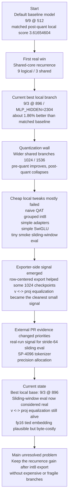

# Parameter Golf Ideas

This file is the shared idea backlog, experiment ledger, and research-loop memory for this project.

Rules for agents:
- Keep ideas loosely ranked by current evidence, and reorder them whenever new evidence changes the picture.
- Edit this file directly when a better ranking, a genuinely novel idea, or a new experiment result appears.
- Every idea should track both the current belief and the latest evidence.
- When an idea is tried, record what was tested and what happened.
- Do not delete weak or rejected ideas unless they are duplicates; keep a short reason so we do not retry bad paths blindly.
- When external research or subagent ideation is used, record what was asked, what actually helped, what was noise, and how the next prompt should change.

## Status Meanings

- `Unvalidated`: not tested yet
- `Testing`: currently being implemented or measured
- `Promising`: tested and worth further investment
- `Weak`: tested and not currently attractive
- `Rejected`: not worth pursuing under current constraints

## Ranking Criteria

Rank ideas by:
- Expected improvement in final post-roundtrip `val_bpb`
- Likelihood of staying under the `16,000,000` byte artifact cap
- Likelihood of remaining trainable within the `10 minute / 8xH100` budget
- Local implementation realism in this repo
- Likely leaderboard legitimacy

## How To Update This File

For each idea, keep these fields current:
- `Status`
- `Why`
- `Latest result`
- `Next step`

When an experiment is run:
- add a short dated note to `Experiment Log`
- update the matching idea's `Latest result`

## Fresh Results

### 2026-03-20 - Runpod SP-4096 smoke failure was a real trainer bug, not pod noise

- Symptom: the cleaned-up migrated-pod `SP-4096` smoke reached export successfully, logged `Total submission size int8+zlib: 6123662 bytes`, then crashed before `final_int8_zlib_roundtrip_exact`.
- Root cause: after adding `EVAL_DOC_ISOLATED`, `eval_val()` gained a required `bos_id` parameter, but the final post-quant roundtrip call in `train_gpt.py` still used the old signature.
- Impact: cloud smoke looked "logically complete but missing final metric" when the real issue was a late `TypeError` after export.
- Fix: pass `bos_id` through the final int8 roundtrip `eval_val(...)` call too, then rerun the smoke with the same `SP-4096` config.

### 2026-03-20 - First clean Runpod SP-4096 exact metric

- Config: `SP-4096`, `MODEL_DIM=640`, `MLP_HIDDEN=1664`, `NUM_LAYERS=9`, `NUM_SHARED_BLOCKS=3`, `NUM_SHARED_MLPS=3`, `TRAIN_SEQ_LEN=1024`, `TRAIN_BATCH_TOKENS=32768`, `ITERATIONS=20`, lower LR schedule, `EVAL_STRIDE_TOKENS=64`, `EVAL_DOC_ISOLATED=1`, `VAL_MAX_TOKENS=1048576`.
- Exact result on the capped 1,046,718-score-token val slice: `final_int8_zlib_roundtrip_exact val_loss:6.46848655 val_bpb:2.84400507`.
- Artifact result: `Serialized model int8+zlib: 6021764 bytes`, `Total submission size int8+zlib: 6123212 bytes`.
- Interpretation: the `SP-4096` branch is now mechanically proven end-to-end on cloud hardware and still has huge byte headroom; the remaining question is comparative quality, not viability.

### 2026-03-20 - Larger SP-4096 width was worse, not better

- Config change vs the conservative smoke: `MODEL_DIM=768`, `MLP_HIDDEN=2048` with the same `SP-4096`, lower-LR schedule, `EVAL_STRIDE_TOKENS=64`, `EVAL_DOC_ISOLATED=1`, and `VAL_MAX_TOKENS=1048576`.
- Exact result on the same capped val slice: `final_int8_zlib_roundtrip_exact val_loss:6.54623695 val_bpb:2.87818965`.
- Artifact result: `Serialized model int8+zlib: 7890451 bytes`, `Total submission size int8+zlib: 7991899 bytes`.
- Interpretation: the extra width spent more bytes and got a worse exact post-quant score than `640/1664`, so the next bytes should go toward higher-signal ideas like tied-embedding protection rather than plain width scaling.

### 2026-03-20 - FP16 token embedding export did not help the conservative SP-4096 branch

- Config change vs the conservative smoke: same `SP-4096 640/1664` branch, but `INT8_KEEP_TOK_EMB_FP16=1`.
- Exact result on the same capped val slice: `final_int8_zlib_roundtrip_exact val_loss:6.46898749 val_bpb:2.84422532`.
- Artifact result: `Serialized model int8+zlib: 8051333 bytes`, `Total submission size int8+zlib: 8152781 bytes`.
- Interpretation: exporter-only FP16 token embedding cost about `2.03 MB` extra counted bytes and was slightly worse than the plain int8-embedding baseline, so the next serious branch should be longer context or schedule work, not this export toggle.

### 2026-03-20 - Longer context also failed to beat the conservative SP-4096 smoke

- Config change vs the conservative smoke: same `SP-4096 640/1664` branch and same lower-LR schedule, but `TRAIN_SEQ_LEN=2048`.
- Exact result on the same capped val slice: `final_int8_zlib_roundtrip_exact val_loss:6.47397697 val_bpb:2.84641905`.
- Artifact result: `Serialized model int8+zlib: 6000294 bytes`, `Total submission size int8+zlib: 6101742 bytes`.
- Interpretation: the leaderboard long-context idea did not transfer to this tiny 1x3090 smoke; on our current cheap-cloud rung, `TRAIN_SEQ_LEN=1024` still beats `2048` for the `SP-4096 640/1664` branch.

### 2026-03-20 - Ported decoupled Muon weight decay from notapplica's winning branch

- Change: added `MUON_WEIGHT_DECAY` to our trainer and apply it as post-step decoupled decay on `matrix_params`, matching the public notapplica pattern.
- Why this one: among the public top-score tricks, this looked like the smallest safe structural port with a plausible chance to matter across branches.
- Status: implemented, not validated yet.
- Next step: test it first on the current best `SP-4096 640/1664` smoke branch before copying lower-confidence tricks like overtone init or phase-transition `resid_mix`.

### 2026-03-20 - Ported overtone embedding init and phase-transition resid_mix init

- Change: added `OVERTONE_EMBED_INIT`, `RESID_MIX_PHASE_INIT`, and `RESID_MIX_PHASE_GAIN` as gated ports of the public notapplica winning-branch initialization tricks.
- Scope: overtone init reshapes the tied embedding singular values to a `k^-0.5` decay; phase init schedules `resid_mixes` from early-`x0` heavy to late-residual heavy.
- Status: implemented, not validated yet.
- Next step: test them only after `MUON_WEIGHT_DECAY`, and prefer isolated branch combinations instead of enabling all three copied tricks at once.

### 2026-03-20 - Tiny local rung says Muon WD and phase init are not free wins

- Comparison rung: same tiny local `sp1024` smoke on the shared-core `9/3 @ 896 / MLP_HIDDEN=2304` branch with `ITERATIONS=4`, `TRAIN_BATCH_TOKENS=16384`, `EVAL_STRIDE_TOKENS=64`, `EVAL_DOC_ISOLATED=1`, and `VAL_MAX_TOKENS=131072`.
- Control:
  - exact `final_int8_zlib_roundtrip_exact val_bpb: 3.93657217`
  - int8+zlib size: `5,979,689`
- `MUON_WEIGHT_DECAY=0.02`:
  - exact `3.93736593`
  - size: `5,971,034`
- `OVERTONE_EMBED_INIT=1`:
  - exact `4.04952126`
  - size: `5,936,524`
- `RESID_MIX_PHASE_INIT=1`:
  - exact `3.96003911`
  - size: `5,963,718`
- `MUON_WEIGHT_DECAY=0.02 + RESID_MIX_PHASE_INIT=1`:
  - exact `3.96038698`
  - size: `5,954,984`
- Interpretation: overtone is clearly bad on this local rung; phase-init and Muon WD are both mechanically safe but slightly worse than the plain control, so none of these copied winning-branch tricks should be promoted based on local tiny-smoke evidence alone.

### 2026-03-20 - Slightly stronger local rung still leaves Muon WD flat

- Comparison rung: same local `sp1024` cheap rung, but with `ITERATIONS=8`, `TRAIN_BATCH_TOKENS=16384`, `WARMUP_STEPS=2`, `WARMDOWN_ITERS=4`, `EVAL_STRIDE_TOKENS=64`, `EVAL_DOC_ISOLATED=1`, and `VAL_MAX_TOKENS=131072`.
- Control:
  - exact `final_int8_zlib_roundtrip_exact val_bpb: 3.75548732`
  - int8+zlib size: `7,223,463`
- `MUON_WEIGHT_DECAY=0.02`:
  - exact `3.75558901`
  - size: `7,204,430`
- Interpretation: the slightly deeper local rung removes most of the 4-step noise excuse and still leaves Muon WD essentially flat/slightly worse, so this branch remains unpromoted locally even though it still might deserve one cloud check later if we run out of better ideas.

### 2026-03-20 - FP32-master tied embeddings are still not a free local win

- Comparison rung: same 8-step local `sp1024` cheap rung as the stronger Muon WD check.
- Control:
  - exact `final_int8_zlib_roundtrip_exact val_bpb: 3.75548732`
  - int8+zlib size: `7,223,463`
- `TIED_EMB_FP32_MASTER=1`:
  - exact `3.75590020`
  - size: `7,223,839`
- Interpretation: the stronger local rung still leaves fp32-master tied embeddings slightly worse than the plain control, so the branch remains strategically plausible from leaderboard evidence but not locally promoted.

### 2026-03-20 - Generic exporter-only exact rung confirms `vproj`, rejects row-centering on the current checkpoint

- New harness tool: `experiments/exporter_exact_probe.py` now gives a generic same-checkpoint exact exporter comparison using the current env-controlled quantization flags, without retraining.
- Checkpoint and rung: current local `final_model.pt`, `seq_len=1024`, `eval_stride=64`, `EVAL_DOC_ISOLATED=1`, `VAL_MAX_TOKENS=32768`.
- Plain export:
  - exact `val_bpb: 3.38825662`
  - size: `8,878,605`
- `INT8_SCALE_REPARAM_KIND=vproj`:
  - exact `3.38633439`
  - size: `8,917,803`
- `INT8_CENTER_ROWS=1`:
  - exact `3.39133140`
  - size: `8,909,907`
- Interpretation: the new trustworthy exporter-only rung immediately re-confirmed the main surviving small signal: weight-only `vproj` still helps on the current checkpoint, while row-centering is worse here.

### 2026-03-20 - Calibration-aware exporter exact rung demotes activation-aware `vproj`, revives narrow GPTQ

- Same checkpoint and rung as the plain/vproj/row-centering exporter comparison: current local `final_model.pt`, `seq_len=1024`, `eval_stride=64`, `EVAL_DOC_ISOLATED=1`, `VAL_MAX_TOKENS=32768`.
- Plain export:
  - exact `3.38825662`
  - size: `8,878,605`
- Weight-only `INT8_SCALE_REPARAM_KIND=vproj`:
  - exact `3.38633439`
  - size: `8,917,803`
- Activation-aware `INT8_ACTIVATION_REPARAM_KIND=vproj`, `INT8_ACTIVATION_REPARAM_ALPHA=0.5`, `INT8_ACTIVATION_REPARAM_CALIB_BATCHES=2`:
  - exact `3.39083767`
  - size: `8,944,174`
- Narrow GPTQ `INT8_GPTQ_TARGET=attn_proj`, `INT8_GPTQ_CALIB_BATCHES=1`:
  - exact `3.38653849`
  - size: `10,174,845`
- Narrow GPTQ `INT8_GPTQ_TARGET=attn_vproj`, `INT8_GPTQ_CALIB_BATCHES=1`:
  - exact `3.38543863`
  - size: `10,693,538`
- Interpretation: on the current checkpoint, activation-aware `vproj` is clearly demoted, weight-only `vproj` remains the best cheap exporter-side tweak, and narrow GPTQ is alive again with `attn_vproj` best of the tested exporter variants, but at a real byte premium of roughly `+1.8 MB` over plain export.

### 2026-03-20 - Fresh checkpoint consistency test says the local exact harness is basically sane

- Purpose: directly test whether trainer final exact and the new generic exporter probe agree on the same saved checkpoint under identical eval settings.
- Fresh control rung: canonical local tiny control (`ITERATIONS=4`, `seq_len=1024`, `eval_stride=64`, `EVAL_DOC_ISOLATED=1`, `VAL_MAX_TOKENS=131072`).
- Trainer final exact on that run:
  - `final_int8_zlib_roundtrip_exact val_bpb: 3.93657217`
  - size: `5,979,689`
- `experiments/exporter_exact_probe.py` on the exact same freshly produced `final_model.pt`:
  - exact `3.93658066`
  - size: `5,979,689`
- Interpretation: the two paths match to tiny numerical noise, which is strong evidence against a major hidden mismatch bug in the local exact-eval/exporter-probe rung.

### 2026-03-20 - Fresh consistency-checked checkpoint refreshes exporter ranking

- Same fresh control checkpoint and identical eval settings as the harness consistency test above.
- Plain export:
  - exact `3.93658066`
  - size: `5,979,689`
- Weight-only `INT8_SCALE_REPARAM_KIND=vproj`:
  - exact `3.89144567`
  - size: `6,201,672`
- Narrow GPTQ `INT8_GPTQ_TARGET=attn_vproj`, `INT8_GPTQ_CALIB_BATCHES=1`:
  - exact `3.89219934`
  - size: `8,835,446`
- Interpretation: on the fresh consistency-checked checkpoint, both exporter-only branches are real wins over plain export, but weight-only `vproj` is slightly better and far cheaper than narrow `attn_vproj` GPTQ.

### 2026-03-20 - Full exporter sweep says activation-aware `vproj` is still alive, but checkpoint-sensitive

- New harness tool: `experiments/exporter_sweep.ps1` runs the main exporter variants on one checkpoint with explicit eval settings and returns a ranked summary.
- Sweep target: the same fresh consistency-checked local control checkpoint as above, with `seq_len=1024`, `eval_stride=64`, `EVAL_DOC_ISOLATED=1`, and `VAL_MAX_TOKENS=131072`.
- Ranked results from the sweep:
  - `activation_vproj`: `3.89104636`, `6,221,827` bytes
  - `vproj`: `3.89144567`, `6,201,672` bytes
  - `gptq_attn_vproj`: `3.89219934`, `8,835,446` bytes
  - `gptq_attn_proj`: `3.89254764`, `8,171,987` bytes
  - `center_rows`: `3.90204599`, `6,023,033` bytes
  - `plain`: `3.93658066`, `5,979,689` bytes
- Interpretation: this is the strongest current evidence that activation-aware `vproj` is not dead, just checkpoint-sensitive. On this fresh checkpoint it narrowly beat weight-only `vproj`, while older tracked-checkpoint probes had it losing. So the right summary is still "mixed/testing", not promoted, but no longer simply demoted.

### 2026-03-20 - Stronger 8-step checkpoint flips the exporter sweep back to plain export

- Same sweep tool and eval settings as above, but on a stronger fresh local control checkpoint trained for `ITERATIONS=8` instead of `4`.
- Ranked results from the sweep:
  - `plain`: `3.75551668`, `7,223,463` bytes
  - `center_rows`: `3.75790431`, `7,259,982` bytes
  - `vproj`: `3.75986421`, `7,410,723` bytes
  - `gptq_attn_proj`: `3.76000592`, `9,240,446` bytes
  - `gptq_attn_vproj`: `3.76034299`, `9,886,137` bytes
  - `activation_vproj`: `3.76388833`, `7,456,276` bytes
- Interpretation: this is the clearest evidence yet that exporter-side rankings are highly checkpoint-depth-sensitive on the local rung. The shallow 4-step checkpoint made several exporter branches look good, but the stronger 8-step checkpoint put plain export back on top and made every tested exporter tweak worse.
- move the idea up or down if the evidence changed the ranking

When a research pass is run:
- add one entry to `Research Log`
- capture the prompt/question shape, not the full raw prompt
- record which ideas were genuinely new versus repeats
- record which suggestions survived contact with repo evidence
- score the pass against the prompt-craft checklist
- end with a short `Prompt delta` so the next pass is sharper than the last one

## Current Snapshot

- Best current local base: shared-core recurrence `9 logical / 3 shared / dim 896`
- Best current short-run local branch: shared-core `9 logical / 3 shared / dim 896` with `MLP_HIDDEN=2304`
- Best confirmed local improvement:
  - about `1.86%` better than a matched `9/9 @ 512` baseline under the current 10-step stride-64 post-quant setup
- Main bottleneck: wider/shared models keep improving before export, then lose too much after int8 roundtrip
- Strongest active clean branches:
  - sliding-window eval
  - moderate MLP widening on the shared-core base
  - `v <-> proj` equalization
  - tied-embedding precision handling
  - post-quant control-tensor tuning
- Current caution:
  - kurtosis regularization and component-decoupled sharing both showed mixed or weak evidence on the short 10-step local loop, so neither should currently replace the plain widened shared-core branch as the main local reference
- Strategically strong but deferred here:
  - tokenizer re-export (`SP-4096`) because local prep needs about `48.17 GB` of raw docs, even though tokenizer artifact accounting may be more favorable than we first assumed
  - longer-context training (`2048+`) because public PR evidence is strong but the short 4060 proxy looked locally unattractive

## Current Research Thesis

- Best current local base: shared-core recurrence (`9 logical / 3 shared / dim 896`) is the strongest branch under the current proxy, not a guaranteed global optimum.
- Main observed bottleneck: post-quant collapse, especially when width moves beyond the current local sweet spot.
- Current strongest surviving sub-signal: attention `v <-> proj` equalization; exact MLP equalization has looked less stable across widths.
- Strong external signal from real 8xH100 PRs: sliding-window eval and tokenizer efficiency matter more than the local 4060 proxy suggested, so local null results there should not be over-weighted.
- New external signal from the broader PR sweep: longer train/eval context and byte-funded wider MLPs look cleaner than many exporter-only tricks, and the first direct local probe says the wider-MLP part is the real win here.
- Current research bias, subject to revision:
  1. quantization-stable architecture or parameterization changes that preserve the recurrence gain
  2. tokenizer, context-length, or evaluation changes that already show clean gains on real challenge runs
  3. exporter or equivalent-transform ideas with same-checkpoint measurable effect
  4. more invasive training-dynamics or precision-allocation ideas if simpler geometry/export fixes stop paying off
  5. treat the short 10-step local proxy as noisy enough that same-code controls matter more than comparing across distant code states

## Progress Timeline

## Prompt Craft

- This is the live prompt-evolution section; after each research pass, update it with what prompt shape worked, what to ask next, and what to avoid repeating.
- Use a verify-first pass before brainstorming when useful: restate the current best branch, the bottleneck, and the already-tried families, then ask the agent to confirm or reject that summary before generating new ideas.
- Keep verification read-only and low-noise: the agent should verify in its head or via read-only reads, not by editing files, logging extra state, or changing the worktree.
- Start from the current best branch and the current bottleneck, then ask for ideas that beat that branch without repeating already-tested families.
- Ask for mechanism-level novelty first; renamed versions of weak ideas should be treated as repeats unless they change the mechanism.
- Keep the prompt short, goal-oriented, and explicit about what counts as a useful comparison.
- Require the agent to return the top ideas plus why they are new, why they target the bottleneck, and the best first experiment.
- Include the current matchable local headline and any clean external signals so the next agent does not overfit to stale proxy comparisons.
- If a prompt keeps drifting, give the agent a candidate summary first and ask it to verify or correct it before asking for fresh ideas, again using read-only checks only.
- After each research pass, record which prompt shape worked, which ideas were genuinely new, and what the next prompt should ask for or avoid.

### Prompt Checklist

- Did the agent clearly identify the current best branch and the real current bottleneck?
- Did it produce genuinely new ideas rather than renamed repeats?
- Did it explain mechanisms instead of broad categories?
- Did it give concrete first experiments that fit this repo?
- Did it respect the no-loophole / leaderboard-safe direction?
- Did it separate real signal from local proxy noise and unsupported claims?

### How To Use It

- Keep the checklist short and mostly yes/no so prompt quality is easy to judge across passes.
- A research pass is good if it scores well on the checklist and changes the ranked backlog in a useful way.
- If a pass scores poorly, update `Prompt Craft` before asking the next agent instead of just running more agents with the same prompt.

## Research Log

### 2026-03-19 - Research refresh after free wins were exhausted
- Question shape: "Find new ideas that specifically beat shared-core recurrence by reducing post-quant collapse, not generic tuning."
- Sources used: parallel subagent ideation and AlphaXiv/web-backed repo review.
- Result: rotation/incoherence and scale reparameterization were the main families that survived; fixed Hadamard was a miss, while `vproj` stayed the stable sub-signal.

### 2026-03-19 - PR and issue audit sweep
- Question shape: "What clean PR and issue signals should change the backlog or the way we compare runs?"
- Sources used: GitHub PRs `#1-#70` and the active repo issues.
- Result: sliding-window eval, tokenizer efficiency, mixed precision as capacity funding, long-context training, and fp16 tied embeddings all looked real; issue #43 strengthened the tokenizer branch strategically; issue #17 mostly reinforced environment caution.

### 2026-03-19 - Targeted idea pass against the widened shared-core winner
- Question shape: "What new ideas specifically beat `9/3 @ 896 / MLP_HIDDEN=2304`, without repeating the failed exporter micro-tweak loop?"
- Sources used: targeted repo-aware subagent ideation focused on the current widened shared-core branch.
- Result: kurtosis-aware MLP regularization is the clearest new training-dynamics idea; component-decoupled sharing and per-block warmdown calibration are the strongest follow-ons if we keep pushing the current family.

### 2026-03-19 - Kurtosis follow-up after fixing the local eval-to-train cache bug
- Question shape: "Is the kurtosis branch still real once the local loop is rerun cleanly on the fixed code path?"
- Sources used: direct local reruns on the current widened shared-core branch after fixing RoPE cache reuse across `torch.inference_mode()` validation and later training.
- Result: mixed. One fixed-path sweep favored `1e-5`, but a later matched confirmation pair produced a much better control (`3.54705695`) and a catastrophic `1e-5` run (`6.55704869`), so the short local loop does not currently support promoting kurtosis as a stable default.

### 2026-03-20 - Activation-aware exporter reparameterization
- Question shape: "Can train-data activation stats make the surviving `v <-> proj` equalization family meaningfully better, or is weight-only `vproj` already the whole signal?"
- Sources used: direct local implementation and reruns on the current widened shared-core branch with train-data-only activation calibration before final int8 export.
- Result: yes, but only at moderate strength. On `9/3 @ 896 / MLP_HIDDEN=2304` with the same 10-step stride-64 local setup:
  - weight-only `INT8_SCALE_REPARAM_KIND=vproj`: `3.61809600`, compressed size `6,560,717`
  - activation-aware `vproj`, `alpha=0.25`, `batches=2`: `3.61906591`, compressed size `6,572,517`
  - activation-aware `vproj`, `alpha=0.5`, `batches=2`: `3.60947320`, compressed size `6,555,412`
  - activation-aware `vproj`, `alpha=1.0`, `batches=2`: `3.62248382`, compressed size `6,628,506`
  Moderate activation-aware scaling was the first follow-up that improved on same-code weight-only `vproj`, while stronger scaling hurt. But a later fresh matched confirmation pair did not hold:
  - fresh control `vproj`: `3.54559696`, compressed size `6,114,857`
  - fresh activation-aware `vproj`, `alpha=0.5`, `batches=2`: `3.59204520`, compressed size `6,373,840`
  So the branch currently looks noisy on the short local loop rather than promoted.

## Ranked Ideas

### 1. Shared-Core Depth Recurrence With Per-Layer FP32 Controls
- Status: `Promising`
- Why: Share large block matrices across multiple logical layers, keep tiny per-logical-layer control tensors untied, and trade saved bytes for more effective capacity.
- Latest result: Implemented and tested locally. It remains the best structural win. Wider settings improve raw quality, but post-quant degradation becomes the bottleneck by `dim 1024+`, so recurrence needs export/quantization help rather than more naive width.
- Next step: Treat this as the current reference architecture and compare new ideas against it unless fresh evidence points to a better base.

### 2. Scale Reparameterization / Equivalent Transforms
- Status: `Testing`
- Why: Reparameterize adjacent layers so difficult activation or weight scales are migrated into more quantization-friendly forms without changing the represented function.
- Latest result: Implemented an exact exporter-only branch that rebalances `relu^2` MLP `fc <-> proj` pairs and attention `v <-> proj` pairs before quantization. The bundled `mlp_vproj` transform helped `9/3 @ 896` on a same-checkpoint comparison (`3.42249372 -> 3.41939305`) while shrinking the compressed file (`8,883,498 -> 8,535,535`), but it hurt `9/3 @ 1024` (`3.44580757 -> 3.44812108`). Breaking the branch apart showed the stable effect is in `vproj`: on `1024`, `vproj` alone improved `3.44580757 -> 3.44521752`, while `mlp` alone regressed; on `896`, `vproj` alone improved `3.43716252 -> 3.43604091`. A new train-data-only activation-aware follow-up on the current widened branch briefly beat same-code weight-only `vproj` when kept moderate:
  - weight-only `vproj`: `3.61809600`, compressed size `6,560,717`
  - activation-aware `vproj`, `alpha=0.5`, `batches=2`: `3.60947320`, compressed size `6,555,412`
  - weaker `alpha=0.25`: `3.61906591`
  - stronger `alpha=1.0`: `3.62248382`
- But a fresh matched confirmation pair then went the other way:
  - fresh control `vproj`: `3.54559696`, compressed size `6,114,857`
  - fresh activation-aware `vproj`, `alpha=0.5`, `batches=2`: `3.59204520`, compressed size `6,373,840`
- Next step: Treat weight-only attention `vproj` as the current stable part of this family. Do not promote activation-aware `vproj` yet; either confirm it with better determinism or move on to stronger quant-calibration ideas such as adaptive clipping or GPTQ-style reconstruction.

### 2a. Moderate MLP Widening On The Shared-Core Base
- Status: `Promising`
- Why: The current shared-core base appears under-invested in MLP capacity, and the artifact cap is not the immediate limiter on the local best branch, so a wider hidden dimension may be a cleaner way to buy quality than more exporter complexity.
- Latest result: This is the strongest new local branch after the PR-guided mixed-precision exploration. On the `9/3 @ 896` base with `EVAL_STRIDE_TOKENS=64` and a short 10-step proxy:
  - baseline `MLP_HIDDEN=1792`: `final_int8_zlib_roundtrip_exact val_bpb 3.56827291`, compressed size `5,533,450`
  - wider `MLP_HIDDEN=2304`: `3.54919676`, compressed size `6,123,000`
  - wider `MLP_HIDDEN=2688`: `3.56047610`, compressed size `6,608,336`
  The `2304` setting was clearly best of the tested values.
- Next step: Treat `MLP_HIDDEN=2304` as the leading follow-on branch from the current shared-core base. Nearby checks at `2176` (`3.59427578`) and `2432` (`3.58679594`) were both worse, so there is no reason to keep sweeping this width range blindly.

### 2b. Kurtosis-Penalized MLP Training
- Status: `Testing`
- Why: Penalize excess kurtosis in MLP weight rows during training so the widened shared-core branch learns smoother, less heavy-tailed weight distributions that survive per-row int8 export better.
- Latest result: Added `KURTOSIS_PENALTY` as an MLP-only training regularizer and reran it cleanly on the current widened branch (`9/3 @ 896`, `MLP_HIDDEN=2304`) after fixing a local RoPE cache bug that could poison training after step-0 validation. Under the same short 10-step stride-64 post-quant setup:
  - fixed-path same-code control `KURTOSIS_PENALTY=0`: `final_int8_zlib_roundtrip_exact val_bpb 3.56176579`, compressed size `6,087,863`
  - fixed-path `KURTOSIS_PENALTY=1e-5`: `3.54295889`, compressed size `5,927,262`
  - fixed-path `KURTOSIS_PENALTY=3e-5`: `3.54789266`, compressed size `6,083,427`
  - fixed-path `KURTOSIS_PENALTY=1e-4`: `3.78083123`, compressed size `5,791,697`
  But a later matched confirmation pair on the same nominal setup shifted hard in the other direction:
  - confirmation control `KURTOSIS_PENALTY=0`: `3.54705695`, compressed size `6,011,854`
  - confirmation `KURTOSIS_PENALTY=1e-5`: `6.55704869`, compressed size `5,663,450`
  So the branch currently looks unstable on this short local loop rather than robustly better.
- Next step: Do not treat this as the new default. Revisit only with a less noisy eval protocol, stricter determinism controls, or a more targeted formulation than the current blunt MLP penalty.

### 2c. Component-Decoupled Sharing (Shared Attention, Less-Shared MLP)
- Status: `Weak`
- Why: The current best branch keeps the whole transformer block shared, but the latest evidence says the incremental gain is coming mostly from MLP capacity rather than uniformly from the whole block. A hybrid sharing scheme could spend bytes where they matter most.
- Latest result: Implemented a narrow version by decoupling MLP sharing from attention sharing with `NUM_SHARED_MLPS`, then tested "shared attention, less-shared MLP" on the `9/3 @ 896` family:
  - refactor control `NUM_SHARED_MLPS=3`, `MLP_HIDDEN=2304`: `final_int8_zlib_roundtrip_exact val_bpb 3.54182495`, compressed size `6,011,854`
  - matched-budget split `NUM_SHARED_MLPS=9`, `MLP_HIDDEN=768`: `3.54167698`, compressed size `6,351,414`
  - larger split `NUM_SHARED_MLPS=9`, `MLP_HIDDEN=1024`: `3.57769543`, compressed size `7,098,835`
  The matched-budget version was effectively a draw (`~0.004%` better, far below the promotion bar) with a larger artifact, and the larger version was clearly worse.
- Next step: Leave this family below stronger branches unless a sharper formulation appears, such as heterogeneous per-shared-block MLP budgets or a more byte-efficient specialization mechanism.

### 2d. Per-Block Warmdown Quantization Calibration
- Status: `Testing`
- Why: Shared blocks are reused across multiple logical depths, so a short post-training calibration pass that optimizes their quantized reconstruction could pay back more than a generic exporter tweak or naive QAT.
- Latest result: Implemented the first narrow version as a post-quant control-tensor tuning phase: roundtrip the large matrix weights through the existing int8 exporter in-memory, leave the tiny untied control/scalar tensors trainable, and run a short late tuning loop on train data before final export. On the current `9/3 @ 896 / MLP_HIDDEN=2304 / NUM_SHARED_MLPS=3` branch under the short local setup:
  - same-code control `POST_QUANT_CONTROL_TUNE_STEPS=0`: `final_int8_zlib_roundtrip_exact val_bpb 3.58972699`, compressed size `6,265,605`
  - tuned `POST_QUANT_CONTROL_TUNE_STEPS=5`, `POST_QUANT_CONTROL_TUNE_LR=0.01`: `3.48631035`, compressed size `5,952,985`
  - tuned confirm: `3.52452419`, compressed size `6,300,311`
  This is the first post-quant branch in a while that produced repeated, non-tiny improvements on the same code path. But it is not an apples-to-apples free win yet: the tuned branch spends extra late training steps, so it must be judged against compute-matched baselines.
  A first compute-matched smoke check (`ITERATIONS=5` plus `POST_QUANT_CONTROL_TUNE_STEPS=5`) was clearly bad:
  - `final_int8_zlib_roundtrip_exact val_bpb 8.03244041`, compressed size `5,623,458`
  Tighter budget splits were also bad:
  - `ITERATIONS=9`, `POST_QUANT_CONTROL_TUNE_STEPS=1`: `8.01088149`, compressed size `5,629,855`
  - `ITERATIONS=8`, `POST_QUANT_CONTROL_TUNE_STEPS=2`: `4.83772932`, compressed size `5,720,081`
  So this branch does not replace ordinary training and does not currently survive budget-tightened local tests; it only looks plausible as a late add-on after enough base optimization.
- Next step: Keep this below cleaner branches for now. Revisit only if we can prove a very cheap late-tuning phase fits inside the real 10-minute budget without materially cannibalizing the main training loop.

### 2e. GPTQ-Style Attention Reconstruction
- Status: `Weak`
- Why: Use train-data calibration activations to do a second-order post-training reconstruction pass on the shared attention `c_v` / `proj` weights before final int8 export, targeting the actual post-quant collapse instead of nudging training dynamics.
- Latest result: Narrow same-checkpoint exporter-only probes on one saved `20`-step `9/3 @ 896 / MLP_HIDDEN=2304` checkpoint initially looked like the cleanest new signal in the latest loop. Using train-data calibration and a GPTQ/OBC-style sequential reconstruction pass:
  - baseline export: `3.63783062`, compressed size `5,778,098`
  - attention `proj` only: `3.60487437`, compressed size `7,995,261`
  - attention `c_v + proj`: `3.60469155`, compressed size `8,662,688`
  - MLP `fc` only: `3.63804545`, compressed size `9,128,195`
  The attention-family branch produced a meaningful fixed-checkpoint gain while staying under the artifact cap, whereas the first MLP-side reconstruction pass was all byte cost and no quality win. But the signal did not survive a fresh current-code checkpoint rerun:
  - refreshed baseline export: `3.42847805`, compressed size `7,401,194`
  - refreshed attention `proj`, `1` calibration batch: `3.43174463`, compressed size `9,396,141`
  - refreshed attention `proj`, `2` calibration batches: `3.43176493`, compressed size `9,396,139`
  - refreshed attention `c_v + proj`, `1` calibration batch: `3.43185223`, compressed size `10,042,323`
  A tiny end-to-end `train_gpt.py` smoke run with `INT8_GPTQ_TARGET=attn_vproj` also completed successfully, so the integrated exporter path is live, but the branch now looks checkpoint-specific and not trustworthy enough to promote.
- Next step: Do not push this branch further right now. Keep the code available, but deprioritize it until a sharper reconstruction formulation or better external evidence justifies revisiting it.

### 3. Rotation / Incoherence Transforms
- Status: `Weak`
- Why: Apply a fixed or learned orthogonal change of basis around large 2D weights so outlier energy is spread across coordinates before int8 quantization instead of dominating a few rows.
- Latest result: Implemented an export-only blockwise Hadamard path and tested it on same checkpoints. On `9/3 @ 896`, post-roundtrip `val_bpb` regressed from `3.45475773` to `3.45520042` while compressed size rose from `8,836,228` to `8,904,542` bytes. On `9/3 @ 1024`, it improved from `3.44899903` to `3.44652087`, but that is only about `0.072%` better, below the `0.1%` promotion threshold, with compressed size still rising from `11,066,108` to `11,142,110` bytes.
- Next step: Leave fixed rotations below stronger options for now. Revisit only if a later learned-rotation or basis-learning branch becomes compelling enough to justify a more invasive implementation.

### 4. Tokenizer Efficiency (Higher-Vocab SentencePiece)
- Status: `Unvalidated`
- Why: A larger tokenizer can directly improve BPB by reducing tokens-per-byte, and public 8xH100 evidence now shows this is not just a theoretical lever.
- Latest result: Strong external evidence from PR #53: `SP-4096` plus stride-64 sliding window reached `1.1888 val_bpb`, with the PR explicitly attributing a major share of the gain to a better compression ratio (`0.30 tokens/byte vs 0.41`). Repo-side plumbing is mostly ready, but a local check showed the current published Hugging Face manifest still exposes only `sp1024`, so `sp4096` is not a one-command cached download yet. Issue #43 also suggests the tokenizer artifact itself may not count toward submission bytes, which makes this branch strategically stronger than our earlier informal byte model.
- Next step: Treat this as a serious branch, not a side note, but it is currently deferred on this machine because local tokenizer/data re-export needs the hosted `docs_selected.jsonl` raw docs file (`~48.17 GB`). Revisit when the download/storage/time cost is acceptable or when better hardware/workspace is available.

### 5. Sliding-Window Evaluation With Overlapping Context
- Status: `Promising`
- Why: Real challenge runs now show that scoring each token with more context can materially lower final BPB within the separate eval budget.
- Latest result: Our tiny smoke tests looked flat, but stronger evidence now points the other way. Official-style PRs show clear gains (`1.1925` in PR #50 with eval-only changes, plus stronger stacked results in PR #53 and PR #65). A follow-up same-checkpoint local comparison on the shared-core `9/3 @ 896` branch with `TRAIN_SEQ_LEN=1024` and `VAL_MAX_TOKENS=65536` improved post-roundtrip `val_bpb` from `3.21166062` to `3.20917860` when switching the final eval from stride `1024` to stride `64`, a small but real `0.0773%` gain.
- Next step: Treat sliding-window eval as a real lever. Keep the implementation, and if we want a higher-confidence local read, test it on a stronger checkpoint or larger validation slice rather than toy smoke runs.

### 6. Long-Context Training + Matching Long-Context Eval
- Status: `Unvalidated`
- Why: Real challenge runs now suggest that training and evaluating at `2048-4096` context is a clean gain source in its own right, not just a garnish on sliding-window eval.
- Latest result: Strong external evidence remains: PR #65 reported `1.1808 val_bpb` with `TRAIN_SEQ_LEN=4096`, tuned Muon, and matching long-context sliding eval; PR #63 independently reached `1.2067` with `SEQ_LEN=2048` plus fp16 tied embeddings. But a corrected local feasibility probe on the current `9/3 @ 896` base showed the limitation of the 4060 proxy: `TRAIN_SEQ_LEN=2048` is technically feasible with `TRAIN_BATCH_TOKENS=16384`, but a short 10-step matched-token run was slower and clearly worse than the `1024` reference (`val_bpb 4.7467` at about `3.21s/step` vs `3.7266` at about `2.59s/step`).
- Next step: Keep this branch strategically alive because of the real-run PR evidence, but do not spend many more 4060 cycles trying to prove it locally. Revisit on better hardware or as part of a more official-style run, not as a short local tuning loop.

### 7. Tied Embedding / Output Head Precision Handling
- Status: `Testing`
- Why: The tied embedding doubles as the output head, so protecting it from low precision may remove a disproportionate amount of damage during both optimization and export.
- Latest result: Strong external evidence from PR #42 says fp16 export here can nearly eliminate the baseline quant gap, and PR #10 adds a useful training-side nuance: the tied embedding should likely remain an fp32-master parameter during optimization, not only get special treatment at export. But on the short local 4060 proxy, the training-side refinement did not turn into a free win: a same-code 10-step `9/3 @ 896` control at `TRAIN_SEQ_LEN=1024` reached `val_bpb 3.5984`, while `TIED_EMB_FP32_MASTER=1` landed at `3.6019` with a slightly larger int8+zlib artifact (`5,645,476 -> 5,661,947` bytes). The earlier exporter-only fp16 probe still moved a tiny 4-sequence proxy loss in the right direction (`5.35634136 -> 5.35576963`) but at a real byte cost (`+7.46%`).
- Next step: Keep this branch alive because the external evidence is strong, but do not assume the training-side fp32-master variant is a free local gain. If continued, judge it on fuller post-quant evals or as a combined training+export precision branch with explicit byte rebalancing.

### 8. Sparse Outlier Sidecar
- Status: `Unvalidated`
- Why: Keep the dense int8 core compact and preserve only the most destructive outliers or sensitive coefficients in a tiny high-precision sidecar.
- Latest result: Newly promoted from research review. It is plausible for the observed width-collapse pattern, but metadata overhead and artifact accounting make it riskier than rotations or scale reparameterization.
- Next step: Defer until after the fixed-rotation exporter probe; only test if the same-checkpoint outlier concentration looks strong enough to justify side metadata.

### 9. Optimizer-Aware Late Quant Fine-Tune
- Status: `Unvalidated`
- Why: Use a short late training phase with a more quantization-friendly optimizer and exact fake quant, rather than relying on naive Muon + fake-quant alone.
- Latest result: Newly promoted from research review. It is more credible than naive QAT, but also more expensive and harder to validate locally than exporter-only ideas.
- Next step: Only revisit after export-side ideas, especially if same-checkpoint fixes show that the remaining gap is training-dynamics rather than quantizer geometry.

### 10. Asymmetric Recurrence Topology
- Status: `Unvalidated`
- Why: Keep three physical blocks but allocate them non-uniformly across logical depth so earlier, more heterogeneous layers specialize more than the later recurrent passes.
- Latest result: Newly promoted from research review as the most credible architecture-side follow-on to the current shared-core branch.
- Next step: Keep behind rotation and scale-reparameterization work; only test after the current export bottleneck is better understood.

### 11. Row-Centered Int8 Export
- Status: `Promising`
- Why: Subtract the per-row mean before quantizing 2D weights, then add it back on dequantization so symmetric int8 bins are used on the centered residual instead of wasting dynamic range on row bias.
- Latest result: Same-checkpoint exporter probes on the clean `9/3 @ 1024` control improved post-roundtrip `val_bpb` from `3.46420609` to `3.46273076` with compressed size increasing only from `11,045,085` to `11,081,284` bytes, and the effect repeated on another `1024` checkpoint. But on the stronger `9/3 @ 896` branch it regressed slightly from `3.43772923` to `3.43820288`.
- Next step: Keep this integrated as an opt-in exporter path and use it selectively on wider shared models where per-row bias seems to be part of the quantization failure mode.

### 12. Per-Row Weight Range Regularization
- Status: `Testing`
- Why: Penalize large per-row maxima during training so the final per-row int8 export has less dynamic range to destroy.
- Latest result: `ROW_MAX_PENALTY=1e-4` on `9/3 @ 1024` improved local post-roundtrip `val_bpb` slightly from `3.46424692` to `3.45161882` on a separate short run, but a stronger `3e-4` penalty regressed to `3.48083960`. The branch has signal, but it is not robust enough yet to call a free win.
- Next step: Leave it below centered export; only revisit with tighter same-checkpoint or longer-run comparisons.

### 13. Quantization-Aware Training Matching Export Path
- Status: `Weak`
- Why: Train the model to survive the repo's actual int8 + zlib roundtrip so the final scored model loses less quality after export.
- Latest result: A first naive fake-quant pass on large linear weights with `QAT_START_STEP=10` did not produce a meaningful free win. `9/3 @ 896` improved only trivially from `3.62855` to `3.62825` post-quant bpb on the capped local proxy, while `9/3 @ 960` got worse and `9/3 @ 1024` improved only by noise-level margins.
- Next step: Leave this aside as a free-win path; revisit only if we redesign QAT more carefully instead of just toggling naive late fake quant or pair it with a different optimizer.

### 14. Grouped Int8 Export (Per-Group Scales)
- Status: `Weak`
- Why: Give each row multiple scale factors instead of one so wider matrices are quantized more precisely.
- Latest result: Implemented with `INT8_GROUP_SIZE`. Same-checkpoint comparisons on `9/3 @ 1024` changed post-roundtrip `val_bpb` only from `3.44280567` to `3.44277812`, and on `9/3 @ 1536` it slightly worsened the result while increasing compressed bytes.
- Next step: Keep the code path available, but deprioritize it behind centered export and other model-side ideas.

### 15. Mixed-Precision Layerwise Export (e.g. int8/int6)
- Status: `Unvalidated`
- Why: Different layers may deserve different export precision, and the most useful version of this idea may be to spend the saved bytes on better model capacity rather than just shrinking artifacts.
- Latest result: Strong external evidence from PR #39: a `10-layer` model with `int8` outer layers and `int6` middle layers reached about `1.2139` mean `val_bpb` across 5 seeds under the real budget. The newer PR #65 strengthened the idea by combining mixed precision with a wider `MLP_MULT=3` branch and stride-64 eval, reaching `1.1630`; the clean sub-idea is that precision allocation can fund more useful width. Locally, the same-checkpoint exporter probe was encouraging but narrower than the PR framing:
  - saved current-best checkpoint, `int6` on `mlp_proj` only: compressed bytes `8,878,592 -> 7,685,366` (`-13.4%`) with only a tiny regression `3.43550794 -> 3.43626937`
  - `int6` on all MLP weights: compressed bytes `8,878,592 -> 6,621,505` but regressed much more strongly to `3.45281219`
  - on the retrained wider-MLP branch, `MLP_HIDDEN=2304` plus `int6 mlp_proj` reached `3.55609707`, which was still worse than plain widened int8 (`3.54919676`) while saving only about `1.3%` compressed bytes (`6,123,000 -> 6,043,219`)
- Next step: Keep this as a credible fallback branch, but the current local evidence says the wider MLP is the real win and mixed precision is only a secondary byte-trimming tool here. Do not prioritize it over plain MLP widening unless we get closer to the artifact cap.

### 16. Low-Rank Factorization Of Selected Large Matrices
- Status: `Unvalidated`
- Why: Reduce parameter bytes in the largest projections, then reinvest the saved budget into width or depth.
- Latest result: Not tested yet.
- Next step: Factorize only selected attention projections first and measure artifact-size headroom before widening.

### 17. SwiGLU Replacement For ReLU^2 MLP
- Status: `Weak`
- Why: Better quality-per-parameter is plausible at this scale if the extra compute cost is acceptable.
- Latest result: Added an opt-in `MLP_KIND=swiglu` path with a near-parameter-matched hidden size. On `9/3 @ 896` it was clearly worse than the current `relu2` branch: post-roundtrip `3.43765442 -> 3.50506778`.
- Next step: Do not keep tuning this blindly on the current local proxy; only revisit if a later idea specifically suggests why SwiGLU should become more quant-stable under a different optimizer or training regime.

### 18. Custom Low-Bit Export Format (INT4 / Mixed Precision Packing)
- Status: `Unvalidated`
- Why: Shrink stored weight bytes beyond the current int8 export and fit more effective capacity under the artifact cap.
- Latest result: Not tested yet.
- Next step: Prototype serialization only, measure compressed bytes, and defer model-quality work until the size win is real.

### 19. Low-Rank Residual Adapters On Shared Blocks
- Status: `Weak`
- Why: Add tiny per-logical-layer float adapter paths so shared blocks can correct recurrence/quantization drift without paying for full untied layers.
- Latest result: A first `ADAPTER_RANK=8` test on `9/3 @ 1024` was decisively bad, jumping local post-roundtrip `val_bpb` to `3.86195309`.
- Next step: Do not sweep adapter ranks blindly; only revisit if we redesign the adapter placement or optimizer treatment.

### 20. Aggressive Compression-Aware Parameterization
- Status: `Unvalidated`
- Why: Bias training toward lower-entropy, more quantization-friendly, more zlib-friendly weights instead of treating compression as a final afterthought.
- Latest result: Not tested yet.
- Next step: Revisit after QAT results; merge if the techniques overlap too much.

### 21. Mostly-Shared Base Weights Plus Small Untied Control Paths
- Status: `Unvalidated`
- Why: Push capacity into large shared tensors and keep behavior flexible with cheap high-precision control tensors.
- Latest result: Not tested yet.
- Next step: Keep separate only if it diverges materially from the recurrence design.

### 22. Local Cache / Copy / n-gram Auxiliary Head For Web Text
- Status: `Unvalidated`
- Why: FineWeb likely has local repetitive structure that tiny dense models underuse.
- Latest result: Not tested yet.
- Next step: Only revisit after the main architecture path is measured.

### 23. Magnitude Pruning For Better Zlib Compression
- Status: `Unvalidated`
- Why: Force exact zeros and hope compression gains outweigh model-quality losses.
- Latest result: Not tested yet.
- Next step: Defer until stronger byte-saving methods are exhausted.

### 24. Persistent Validation KV Cache Across Chunks
- Status: `Rejected`
- Why: Likely too rule-sensitive for the first serious leaderboard-safe path.
- Latest result: Rejected on legitimacy grounds before implementation.
- Next step: None unless the challenge organizers explicitly endorse this style of eval carryover.

## Rejected Or Deprioritized

### Generic Hyperparameter Tuning Alone
- Status: `Rejected`
- Why: Too incremental and too likely already explored by others unless paired with a stronger architectural idea.
- Latest result: Not pursued.
- Next step: Only revisit as polishing on top of a stronger idea.

### Simply Training Longer
- Status: `Rejected`
- Why: Does not address the leaderboard track constraint and does not solve the post-quant degradation problem.
- Latest result: Rejected as off-track for the main leaderboard path.
- Next step: None for the main track.

### Naive "Make Model Bigger"
- Status: `Rejected`
- Why: The artifact cap is the core constraint; raw parameter growth without a byte strategy is not useful.
- Latest result: Rejected conceptually.
- Next step: None.

## Experiment Log

### 2026-03-19
- Seeded the ranked backlog from agent ideation and initial repo review.
- Added a Windows-safe local loop: CUDA venv on `D:\venvs\parameter-golf`, Windows-safe math SDP fallback, compile disable switch, local validation cap via `VAL_MAX_TOKENS`, and `SKIP_FINAL_QUANT_EVAL` for fast smoke runs.
- Verified fast local smoke on the RTX 4060 with `TRAIN_SEQ_LEN=256`, `TRAIN_BATCH_TOKENS=2048`, and `VAL_MAX_TOKENS=65536`; the loop now finishes in seconds instead of waiting on full validation.
- Implemented sliding-window validation and compared `EVAL_STRIDE_TOKENS=256`, `128`, and `64` on the tiny smoke config; no measurable difference showed up on that toy checkpoint.
- Implemented shared-core recurrence with per-logical-layer control tensors via `NUM_SHARED_BLOCKS`.
- Local recurrence sweep summary on capped validation after 25 steps:
  - baseline `9/9 @ 512`: pre-quant `3.6237`, post-quant `3.6465`
  - shared `9/3 @ 896`: pre-quant `3.5702`, post-quant `3.6285`
  - shared `9/3 @ 1024`: pre-quant `3.5653`, post-quant `3.6459`
  - shared `9/3 @ 1536`: pre-quant `3.5560`, post-quant `3.7418`
- Current conclusion: shared recurrence is promising, width helps, but quantization becomes the dominant limiter beyond roughly the `896` width range on the local short-run proxy.
- Naive QAT sweep summary on the shared branch with `QAT_START_STEP=10`:
  - shared `9/3 @ 896`: post-quant `3.6285 -> 3.6283` tiny improvement
  - shared `9/3 @ 960`: post-quant `3.6364 -> 3.6366` worse
  - shared `9/3 @ 1024`: post-quant `3.6459 -> 3.6456` tiny improvement
- Current conclusion: naive late fake-quant is not a worthwhile free win; the architecture branch gave a real gain, but the first QAT version did not.
- Added grouped int8 export via `INT8_GROUP_SIZE` and tested it on same-checkpoint probes:
  - `9/3 @ 1024`: `3.44280567 -> 3.44277812` post-quant bpb, tiny improvement for extra scale bytes
  - `9/3 @ 1536`: `3.52435415 -> 3.52438782` post-quant bpb, slight regression
- Current conclusion: grouped scales are not the free exporter win they first appeared to be; keep the code, lower the priority.
- Added low-rank residual adapters via `ADAPTER_RANK`.
  - `9/3 @ 1024`, `ADAPTER_RANK=8`: post-quant `3.86195309`
- Current conclusion: the first adapter version is a clear miss and should not be rank-swept casually.
- Added `ROW_MAX_PENALTY` training regularization:
  - `9/3 @ 1024`, `1e-4`: post-quant `3.45161882`
  - `9/3 @ 1024`, `3e-4`: post-quant `3.48083960`
- Current conclusion: row-range regularization may have a narrow useful range, but it is not robust enough yet to outrank stronger ideas.
- Added row-centered int8 export via `INT8_CENTER_ROWS` and verified it on same checkpoints:
  - clean `9/3 @ 1024` control: `3.46420609 -> 3.46273076`, compressed size `11,045,085 -> 11,081,284` bytes
  - another `1024` checkpoint: similar ~`0.0012` bpb gain
- Added a follow-up probe on the current best `9/3 @ 896` checkpoint:
  - `3.43772923 -> 3.43820288`, compressed size `8,883,503 -> 8,914,637` bytes
- Current conclusion: centered export is a real width-recovery tool for the `1024` branch, but not a universal default for the best current `896` branch.
- Added an opt-in SwiGLU MLP path via `MLP_KIND=swiglu` with near-matched hidden size.
  - `9/3 @ 896`: post-quant `3.43765442 -> 3.50506778`
- Current conclusion: the first SwiGLU branch is clearly worse on the best current shared-core model and should not be tuned further as a free win.
- Added a research refresh using AlphaXiv/web-backed parallel agent passes.
  - Independent threads converged on rotations/incoherence transforms as the strongest new idea.
  - Scale reparameterization / equivalent transforms emerged as the strongest second family.
  - Sparse outlier sidecars, optimizer-aware late quant fine-tuning, and asymmetric recurrence topology were promoted as secondary candidates.
- Current conclusion: the obvious next branch is an export-only rotation probe, not more blind tuning on the existing backlog.
- Implemented an export-only blockwise Hadamard rotation path with `INT8_ROTATION_KIND`, `INT8_ROTATION_BLOCK_SIZE`, and `INT8_ROTATION_TARGET`.
- Verified functionally that the Hadamard path inverts to numerical precision and safely skips non-divisible tensors.
- Same-checkpoint exporter probes:
  - `9/3 @ 896`: post-quant `3.45475773 -> 3.45520042`, compressed size `8,836,228 -> 8,904,542`
  - `9/3 @ 1024`: post-quant `3.44899903 -> 3.44652087`, compressed size `11,066,108 -> 11,142,110`
- Current conclusion: fixed blockwise Hadamard export is a real but too-small width-recovery effect. It misses the `0.1%` improvement bar, so the next serious branch should move to scale reparameterization / equivalent transforms instead of escalating fixed rotations.
- Implemented an exact exporter-only scale-reparameterization path with `INT8_SCALE_REPARAM_KIND` and `INT8_SCALE_REPARAM_CLAMP`.
- Verified functionally that both supported exact transforms preserve outputs to numerical precision:
  - `relu^2` MLP `fc ↔ proj`
  - attention `v ↔ proj` under GQA-aware channel repetition
- Same-checkpoint exporter probes:
  - `9/3 @ 896`, bundled `mlp_vproj`: `3.42249372 -> 3.41939305`, compressed size `8,883,498 -> 8,535,535`
  - `9/3 @ 1024`, bundled `mlp_vproj`: `3.44580757 -> 3.44812108`, compressed size `11,063,310 -> 10,581,948`
  - `9/3 @ 1024` breakdown:
    - `mlp`: `3.44877007`
    - `vproj`: `3.44521752`
    - `mlp_vproj`: `3.44812108`
  - `9/3 @ 896` breakdown:
    - `mlp`: `3.43721597`
    - `vproj`: `3.43604091`
    - `mlp_vproj`: `3.43586773`
- Current conclusion: this family is more promising than fixed rotations, but the useful part is specifically attention `v ↔ proj` equalization. Exact MLP equalization is unstable across widths and should not be the default continuation.
- Reviewed stronger public PRs and then reran sliding-window eval on a less toy-like local checkpoint:
  - current shared-core branch `9/3 @ 896`, `TRAIN_SEQ_LEN=1024`, `VAL_MAX_TOKENS=65536`
  - same checkpoint final eval:
    - standard stride `1024`: `3.21166062`
    - sliding stride `64`: `3.20917860`
- Current conclusion: the local proxy now agrees directionally with the public PR evidence that sliding-window eval is a real lever, even if the gain on this local checkpoint is much smaller than on 8xH100.
- Verified tokenizer branch readiness after reviewing PR #53:
  - existing data scripts already support `sp<VOCAB_SIZE>` variants, including `sp4096`
  - the local repo only lacked the `sp_bpe_4096` entry in `data/tokenizer_specs.json`
- Tried to fetch a cached `sp4096` slice via `cached_challenge_fineweb.py` and hit a real limitation:
  - the current published Hugging Face `datasets/manifest.json` only exposes `fineweb10B_sp1024`
  - `fineweb10B_sp4096` is therefore not currently available as a cached remote dataset through the helper
- Current conclusion: the tokenizer branch is still real, but it needs local tokenizer/data re-export rather than a simple cached download.
- Added an fp16 tied-embedding exporter hook via `INT8_KEEP_TOK_EMB_FP16` and ran a same-checkpoint micro-probe on the saved `9/3 @ 896` checkpoint:
  - standard int8 export: compressed bytes `8,020,963`, 4-sequence proxy loss `5.35634136`
  - keep `tok_emb.weight` in fp16: compressed bytes `8,619,404`, 4-sequence proxy loss `5.35576963`
- Current conclusion: fp16 tied embedding likely helps, but the local gain is small on this checkpoint and the byte tax is non-trivial (`+7.46%`). This stays alive as a precision-allocation branch, but it should be judged on fuller evals and possibly paired with capacity rebalancing.
- Ran corrected long-context local probes on the current `9/3 @ 896` base using enough tokens per micro-step for `grad_accum_steps=8`:
  - `TRAIN_SEQ_LEN=2048`, `TRAIN_BATCH_TOKENS=16384`, `VAL_BATCH_SIZE=16384`, `ITERATIONS=1`: feasibility check passed at about `2.03s` train time, `2540 MiB` peak allocated, showing the branch is runnable locally
  - matched 10-step token-budget probe:
    - `TRAIN_SEQ_LEN=2048`: `val_bpb 4.7467`, step average `~3213ms`, peak allocated `2608 MiB`
    - `TRAIN_SEQ_LEN=1024`: `val_bpb 3.7266`, step average `~2587ms`, peak allocated `1841 MiB`
- Current conclusion: longer context is strategically real from public PR evidence, but the short 4060 proxy currently makes it look both slower and worse; this is not a good local branch to keep grinding on without better hardware or a more official-style run.
- Added an opt-in training-side tied-embedding refinement via `TIED_EMB_FP32_MASTER` and compared it on a same-code 10-step local control:
  - control `TRAIN_SEQ_LEN=1024`, `TRAIN_BATCH_TOKENS=16384`: `val_bpb 3.5984`, int8+zlib bytes `5,645,476`
  - `TIED_EMB_FP32_MASTER=1`: `val_bpb 3.6019`, int8+zlib bytes `5,661,947`
- Current conclusion: keeping the tied embedding fp32-master during training is plausible from external evidence, but it is not a free local win on the short 4060 proxy. Keep the idea alive, but do not prioritize it over branches with clearer same-checkpoint signal.
- Added packed low-bit export support via `INT8_LOWBIT_BITS` and `INT8_LOWBIT_TARGET` and ran same-checkpoint probes on the saved current-best checkpoint:
  - baseline export: `8,878,592` bytes, `3.43550794`
  - `int6` on `mlp_proj` only: `7,685,366` bytes, `3.43626937`
  - `int6` on all MLP weights: `6,621,505` bytes, `3.45281219`
- Current conclusion: narrow mixed precision on `mlp_proj` is a credible byte saver, but full-MLP `int6` is too destructive and the exporter trick alone is not the main win.
- Tested the PR-guided "buy wider MLP capacity" idea directly on the shared-core `9/3 @ 896` base with `EVAL_STRIDE_TOKENS=64` and short 10-step local post-quant probes:
  - baseline `MLP_HIDDEN=1792`: `final_int8_zlib_roundtrip_exact val_bpb 3.56827291`, compressed size `5,533,450`
  - nearby `MLP_HIDDEN=2176`: `3.59427578`, compressed size `6,097,683`
  - wider `MLP_HIDDEN=2304`: `3.54919676`, compressed size `6,123,000`
  - nearby `MLP_HIDDEN=2432`: `3.58679594`, compressed size `6,400,596`
  - wider `MLP_HIDDEN=2688`: `3.56047610`, compressed size `6,608,336`
  - wider `MLP_HIDDEN=2304` plus `int6 mlp_proj`: `3.55609707`, compressed size `6,043,219`
  - wider `MLP_HIDDEN=2304` plus `vproj` equalization: `3.59200479`, compressed size `6,422,416`
- Current conclusion: the real local win is moderate MLP widening itself, with `MLP_HIDDEN=2304` best of the tested settings. The mixed-precision and `vproj` stack-ons did not beat plain widened int8 on this branch.
- Ran a matched baseline comparison under the same short post-quant setup:
  - original-style baseline `9/9 @ 512`: `final_int8_zlib_roundtrip_exact val_bpb 3.61654604`, compressed size `6,905,103`
  - current best short-run branch `9/3 @ 896`, `MLP_HIDDEN=2304`: `3.54919676`, compressed size `6,123,000`
- Current conclusion: under the current apples-to-apples short local setup, the best measured branch is about `1.86%` better than the matched baseline.
- Added `KURTOSIS_PENALTY` as an MLP-only training regularizer inspired by the latest idea pass and tested it on the widened branch with same-code controls:
  - same-code control `KURTOSIS_PENALTY=0`: `final_int8_zlib_roundtrip_exact val_bpb 3.57991740`, compressed size `6,237,578`
  - `KURTOSIS_PENALTY=1e-5`: `3.57012118`, compressed size `6,207,818`
  - `KURTOSIS_PENALTY=3e-5`: `3.56901227`, compressed size `6,208,211`
- Current conclusion: kurtosis regularization is the first new post-agent idea that showed a clean same-code local gain on the widened branch, but the short 10-step proxy is noisy enough that it should be treated as a promising signal, not final proof.
- Fixed a real local loop bug in RoPE cache handling: step-0 validation under `torch.inference_mode()` could populate cached rotary tensors that later broke training autograd on the same process.
- Reran the widened kurtosis branch on the fixed path with `VAL_MAX_TOKENS=16384` restored for matched short-run comparisons:
  - fixed-path control `KURTOSIS_PENALTY=0`: `final_int8_zlib_roundtrip_exact val_bpb 3.56176579`, compressed size `6,087,863`
  - fixed-path `KURTOSIS_PENALTY=1e-5`: `3.54295889`, compressed size `5,927,262`
  - fixed-path `KURTOSIS_PENALTY=3e-5`: `3.54789266`, compressed size `6,083,427`
  - fixed-path `KURTOSIS_PENALTY=1e-4`: `3.78083123`, compressed size `5,791,697`
- Current conclusion: the branch survives the bug fix. `1e-5` is the current best kurtosis setting on the matched fixed code path, `3e-5` still helps, and `1e-4` is clearly too strong.
- Ran a later confirmation pair for the kurtosis branch on the same nominal fixed path:
  - confirmation control `KURTOSIS_PENALTY=0`: `final_int8_zlib_roundtrip_exact val_bpb 3.54705695`, compressed size `6,011,854`
  - confirmation `KURTOSIS_PENALTY=1e-5`: `6.55704869`, compressed size `5,663,450`
- Current conclusion: the short local loop is too unstable to promote kurtosis as a new default from these runs alone.
- Implemented decoupled MLP sharing via `NUM_SHARED_MLPS` so attention sharing and MLP sharing can be tested independently.
- Verified the refactor on the current branch:
  - control `NUM_SHARED_MLPS=3`, `MLP_HIDDEN=2304`: `3.54182495`
- Tested the first "shared attention, less-shared MLP" branch on the `9/3 @ 896` family:
  - matched-budget split `NUM_SHARED_MLPS=9`, `MLP_HIDDEN=768`: `3.54167698`, compressed size `6,351,414`
  - larger split `NUM_SHARED_MLPS=9`, `MLP_HIDDEN=1024`: `3.57769543`, compressed size `7,098,835`
- Current conclusion: the first component-decoupled sharing probes are not strong enough to keep grinding; the matched-budget version is basically a draw and the larger version is worse.
- Implemented a first post-quant calibration branch by roundtripping matrix weights through the existing int8 exporter in-memory and running a short late train-data tuning loop on the untied control/scalar tensors only.
- Same-code short local probes on the current widened branch:
  - control `POST_QUANT_CONTROL_TUNE_STEPS=0`: `final_int8_zlib_roundtrip_exact val_bpb 3.58972699`, compressed size `6,265,605`
  - tuned `POST_QUANT_CONTROL_TUNE_STEPS=5`, `POST_QUANT_CONTROL_TUNE_LR=0.01`: `3.48631035`, compressed size `5,952,985`
  - tuned confirm: `3.52452419`, compressed size `6,300,311`
- Current conclusion: this is the strongest new post-quant branch in the latest loop, but it is not yet a clean headline because the tuned branch spends extra late training steps and therefore needs a compute-matched control before promotion to the main current-best branch.
- First compute-matched smoke check:
  - `ITERATIONS=5` + `POST_QUANT_CONTROL_TUNE_STEPS=5`: `final_int8_zlib_roundtrip_exact val_bpb 8.03244041`, compressed size `5,623,458`
- Tighter budget splits were also poor:
  - `ITERATIONS=9` + `POST_QUANT_CONTROL_TUNE_STEPS=1`: `final_int8_zlib_roundtrip_exact val_bpb 8.01088149`, compressed size `5,629,855`
  - `ITERATIONS=8` + `POST_QUANT_CONTROL_TUNE_STEPS=2`: `4.83772932`, compressed size `5,720,081`
- Current conclusion: the late control-tuning phase is not a substitute for main training and does not currently survive tighter total-step budgets; it only looks plausible as an add-on after enough base optimization.
- Reran the plain current widened branch as a harness sanity check and confirmed the old score range is still reachable, but the 10-step loop is too noisy to trust tiny deltas:
  - same nominal plain branch rerun A: `3.56872186`
  - same nominal plain branch rerun B: `3.54116535`
- Added a strict local determinism mode (`STRICT_DETERMINISM=1`) that disables TF32/fused Adam and tightens CUDA determinism for debugging, then tested it on the same plain branch:
  - strict rerun A: `3.54207253`
  - strict rerun B: `3.56364567`
  - stricter Muon-fp32 rerun A: `3.56925742`
  - stricter Muon-fp32 rerun B: `4.26011008`
- Current conclusion: there is still no single obvious training bug, but the short local loop is not reproducible enough for promotion-grade evidence; strict determinism is useful as a diagnostic, not as the default ranking mode.
- Switched to a same-checkpoint exporter-only probe on the saved 20-step `9/3 @ 896 / MLP_HIDDEN=2304` checkpoint and tested adaptive clipping without retraining:
  - baseline export: `3.44982135`, compressed size `6,886,666`
  - adaptive clipping `8` steps, min percentile `99.0`: `3.44985471`, compressed size `6,886,471`
  - adaptive clipping `16` steps, min percentile `99.0`: `3.44983465`, compressed size `6,886,446`
- Current conclusion: naive adaptive clipping is effectively flat on a fixed checkpoint and should not be the next main branch.
- Built a reusable same-checkpoint GPTQ probe and used it to test narrow second-order reconstruction on the saved widened checkpoint using train-data calibration:
  - baseline export: `3.63783062`, compressed size `5,778,098`
  - attention `proj` only: `3.60487437`, compressed size `7,995,261`
  - attention `c_v + proj`: `3.60469155`, compressed size `8,662,688`
  - MLP `fc` only: `3.63804545`, compressed size `9,128,195`
- Current conclusion: exporter-only second-order reconstruction is now the strongest clean quant-calibration signal in the repo, but it is narrow. The live branch is attention-family GPTQ, not broad all-layer reconstruction.
- Integrated the narrow GPTQ branch into `train_gpt.py` behind `INT8_GPTQ_TARGET` and verified a tiny end-to-end smoke run with `INT8_GPTQ_TARGET=attn_vproj`, `INT8_GPTQ_CALIB_BATCHES=1` completed through final exact int8 eval.
- Regenerated a fresh current widened checkpoint on the current codebase and reran the same-checkpoint GPTQ comparisons:
  - refreshed baseline export: `3.42847805`, compressed size `7,401,194`
  - refreshed attention `proj`, `1` calibration batch: `3.43174463`, compressed size `9,396,141`
  - refreshed attention `proj`, `2` calibration batches: `3.43176493`, compressed size `9,396,139`
  - refreshed attention `c_v + proj`, `1` calibration batch: `3.43185223`, compressed size `10,042,323`
- Current conclusion: the earlier GPTQ win did not hold on the fresh checkpoint. The branch is now mixed / checkpoint-specific rather than promoted.
- Moved the tokenizer branch onto Runpod after the local 16 GB laptop proved too small for the full docs-based rebuild:
  - first pod tried the correct `runpod/parameter-golf:latest` template on an `RTX 3090`, but SSH had been disabled in the UI, so it was deleted and recreated with SSH enabled before doing any real work
  - the pod image defaults Hugging Face cache writes into the small `/root` overlay; the initial `docs_selected.jsonl` download failed there despite the large `/workspace` volume, then succeeded once `HF_HOME=/workspace/.cache/huggingface` and `HUGGINGFACE_HUB_CACHE=/workspace/.cache/huggingface/hub` were set
  - after download, there was a second ~`45 GB` duplicate under `/workspace/.cache`; deleting that cache after the raw docs landed restored the expected storage headroom
- Pod-side tokenizer feasibility check on the real docs cache:
  - downloaded the published `sp1024` tokenizer plus `docs_selected.jsonl` onto the pod
  - trained a full `sp4096` SentencePiece model on the raw docs only (no shard export yet for this probe)
  - measured fertility on the first `5,000` validation docs:
    - `sp1024`: `0.4157568644` tokens/byte
    - `sp4096`: `0.3066736453` tokens/byte
    - ratio `sp4096 / sp1024`: `0.7376273769`
- Current conclusion: the tokenizer branch finally has direct in-repo evidence that matches the external PR claims closely enough to justify the full `sp4096` shard export.
- Launched the full `sp4096` local re-export on the pod using the already-trained tokenizer via `--reuse-sp-model`:
  - output root: `/workspace/pg-sp4096-export`
  - process log: `/workspace/parameter-golf/logs/sp4096_full_export.log`
  - status at launch: running cleanly with log lines `Reusing existing local docs cache...` and `Exporting dataset: fineweb10B_sp4096`
- Full `sp4096` pod export completed successfully:
  - success line: `Done. Manifest: /workspace/pg-sp4096-export/manifest.json`
  - dataset: `fineweb10B_sp4096`
  - tokenizer: `sp_bpe_4096`
  - stats from manifest:
    - `docs_total`: `15,368,808`
    - `docs_val`: `50,000`
    - `docs_train`: `15,318,808`
    - `files_total`: `144`
    - `files_val`: `1`
    - `files_train`: `143`
    - `tokens_total`: `14,315,946,905`
    - `tokens_val`: `45,516,437`
    - `tokens_train`: `14,270,430,468`
  - dataset directory size on pod: about `27 GB`
- Monitoring outcome:
  - the detached completion watcher plus 10-minute progress poller worked, but the first blocking stall heuristic fired at the same moment the export exited because the file count had plateaued before the final manifest write
  - current conclusion: use `.done`/manifest success markers as the authoritative finish signal and treat simple no-growth stall rules as advisory only
- Operational conclusion:
  - the tokenizer branch is no longer hypothetical; we now have a finished in-repo `sp4096` export ready for model runs
  - after export completion the Runpod pod was stopped to save credits during the pause before the first `sp4096` training probe
- Official leaderboard scan on `2026-03-20` changed priorities:
  - strongest repeated signals across the top `track_10min_16mb` records are `doc-isolated sliding eval`, longer context (`2048/4096`), lower LR / longer warmdown, and tied-embedding precision; exporter-only micro-tweaks look secondary by comparison
  - the current top record is `2026-03-19_SlidingWindow_FP16Emb_10L_MuonWD_OvertoneInit`, but the cleaner takeaway from the surrounding records is that eval/context/schedule/embedding precision are the real shared wins, while overtone/residual-mixing style extras are under-ablated
- Implemented a first repo-side `doc-isolated` eval path in `train_gpt.py` behind `EVAL_DOC_ISOLATED=1`:
  - validation loading can now preserve full document boundaries instead of forcing the val split into one flat `TRAIN_SEQ_LEN`-aligned stream
  - the new eval branch splits documents on `BOS` (current export prepends `BOS` and does not append `EOS`), partitions docs across ranks, and prevents any scoring context from crossing document boundaries
  - cheap verification passed: `py_compile` succeeded, real local val shards show exactly `50,000` `BOS`-delimited docs, and a tiny GPU smoke using the new eval path returned a valid `val_loss` / `val_bpb`
- Current conclusion:
  - best next local/cloud direction is now `doc-isolated eval + SP-4096 + schedule/context work`, not more GPTQ/adaptive-clipping style exporter probing
  - first same-checkpoint local checks on an older `9/3 @ 896 / MLP_HIDDEN=1792` raw checkpoint are mixed but alive rather than dead:
    - first `20`-doc slice at `EVAL_STRIDE_TOKENS=64`: doc-isolated was slightly worse (`+0.0066 bpb`)
    - second `50`-doc slice on the same checkpoint/settings: doc-isolated was slightly better (`-0.00485 bpb`)
    - take this as an early directional smoke only; it is enough to keep the branch alive, but not enough to promote it without a fuller same-checkpoint evaluation
  - thermal-governed local follow-up on the same checkpoint kept the 4060 well under the requested temp ceiling while strengthening the signal slightly:
    - `60` docs: `flat 3.44697296` vs `doc-isolated 3.44556630` (`-0.00140667 bpb`)
    - `120` docs: `flat 3.47205114` vs `doc-isolated 3.46942384` (`-0.00262731 bpb`)
    - `300` docs: `flat 3.44462959` vs `doc-isolated 3.44389556` (`-0.00073404 bpb`)
    - interpretation: the effect currently looks real but small on this older local checkpoint; enough to keep enabled as a serious eval option, not enough to treat as the main headline by itself
### 2026-03-20 - Runpod SP-4096 smoke failure was a real trainer bug, not pod noise

- Symptom: the cleaned-up migrated-pod `SP-4096` smoke reached export successfully, logged `Total submission size int8+zlib: 6123662 bytes`, then crashed before `final_int8_zlib_roundtrip_exact`.
- Root cause: after adding `EVAL_DOC_ISOLATED`, `eval_val()` gained a required `bos_id` parameter, but the final post-quant roundtrip call in `train_gpt.py` still used the old signature.
- Impact: cloud smoke looked "logically complete but missing final metric" when the real issue was a late `TypeError` after export.
- Fix: pass `bos_id` through the final int8 roundtrip `eval_val(...)` call too, then rerun the smoke with the same `SP-4096` config.
